# LLD Interview Prep — Running Notes (C++)

Part 1: OOP Fundamentals · Part 2: UML Diagrams · Part 3: SOLID (S, O, L, I, D) · (more parts added as you progress)

## Index

- [LLD Interview Prep — Running Notes (C++)](#lld-interview-prep--running-notes-c)
  - [Index](#index)
  - [Part 1: OOP Fundamentals](#part-1-oop-fundamentals)
    - [1. Encapsulation](#1-encapsulation)
    - [2. Abstraction](#2-abstraction)
    - [3. Inheritance](#3-inheritance)
    - [4. Polymorphism](#4-polymorphism)
    - [OOP Quick Recap Table](#oop-quick-recap-table)
  - [Where OOP connects to SOLID (preview)](#where-oop-connects-to-solid-preview)
  - [Part 2: UML Diagrams](#part-2-uml-diagrams)
    - [2.1 Class Diagram — structure](#21-class-diagram--structure)
    - [2.2 Class Associations — the 4 relationship types](#22-class-associations--the-4-relationship-types)
    - [2.3 More examples — from problems you'll actually build](#23-more-examples--from-problems-youll-actually-build)
    - [2.4 Sequence Diagram — behavior over time](#24-sequence-diagram--behavior-over-time)
  - [Part 3: SOLID Principles](#part-3-solid-principles)
    - [Why design principles matter](#why-design-principles-matter)
    - [3.1 Single Responsibility Principle (SRP)](#31-single-responsibility-principle-srp)
    - [3.2 Open/Closed Principle (OCP)](#32-openclosed-principle-ocp)
    - [3.3 Liskov Substitution Principle (LSP)](#33-liskov-substitution-principle-lsp)
      - [3.3.1 The 4 formal LSP sub-rules](#331-the-4-formal-lsp-sub-rules)
    - [3.4 Interface Segregation Principle (ISP)](#34-interface-segregation-principle-isp)
    - [3.5 Dependency Inversion Principle (DIP)](#35-dependency-inversion-principle-dip)
  - [Part 4: Design Patterns](#part-4-design-patterns)
    - [4.1 Strategy Pattern](#41-strategy-pattern)
      - [Why this pattern exists — the bad design first](#why-this-pattern-exists--the-bad-design-first)
      - [The fix — Strategy](#the-fix--strategy)
      - [The generic Strategy template](#the-generic-strategy-template)
      - [Real-world examples (recognize the shape, not just the robot)](#real-world-examples-recognize-the-shape-not-just-the-robot)
      - [Core principles this pattern is built from](#core-principles-this-pattern-is-built-from)
    - [4.2 Factory Pattern](#42-factory-pattern)
      - [Why this pattern exists — the bad design first](#why-this-pattern-exists--the-bad-design-first-1)
      - [4.2.1 Simple Factory](#421-simple-factory)
      - [4.2.2 Factory Method](#422-factory-method)
      - [4.2.3 Abstract Factory](#423-abstract-factory)
      - [Simple Factory vs Factory Method vs Abstract Factory — the actual difference](#simple-factory-vs-factory-method-vs-abstract-factory--the-actual-difference)
      - [Real-world example — Notification system](#real-world-example--notification-system)
    - [4.3 Singleton Pattern](#43-singleton-pattern)
      - [The mechanics worth understanding first — stack vs heap](#the-mechanics-worth-understanding-first--stack-vs-heap)
      - [Why this pattern exists — the bad design first](#why-this-pattern-exists--the-bad-design-first-2)
      - [4.3.1 Simple Singleton (lazy initialization, not thread-safe)](#431-simple-singleton-lazy-initialization-not-thread-safe)
      - [4.3.2 Thread-safe Singleton (mutex-locked)](#432-thread-safe-singleton-mutex-locked)
      - [4.3.3 Double-checked locking Singleton](#433-double-checked-locking-singleton)
      - [4.3.4 Eager initialization Singleton](#434-eager-initialization-singleton)
      - [Comparing all four variants](#comparing-all-four-variants)
      - [Real-world examples](#real-world-examples)
  - [LLD Problems — Solved](#lld-problems--solved)
    - [Problem 1: Document Editor (Google Docs)](#problem-1-document-editor-google-docs)
    - [Problem 2: Zomato — Food Delivery App](#problem-2-zomato--food-delivery-app)
      - [Detailed class diagram](#detailed-class-diagram)
      - [What each class does](#what-each-class-does)
      - [How SOLID is maintained](#how-solid-is-maintained)
      - [Relations used (mapped to Part 2 vocabulary)](#relations-used-mapped-to-part-2-vocabulary)
      - [Full code](#full-code)
      - [Further improvements](#further-improvements)
        - [Improvement 1 — Payment Factory](#improvement-1--payment-factory)
        - [Improvement 2 — NotificationService made abstract, with concrete SMS/Email](#improvement-2--notificationservice-made-abstract-with-concrete-smsemail)
        - [Improvement 3 — Layered orchestration (Controller / Service separation)](#improvement-3--layered-orchestration-controller--service-separation)
      - [Remaining improvement points (not yet applied)](#remaining-improvement-points-not-yet-applied)

---

## Part 1: OOP Fundamentals

### 1. Encapsulation

**Definition:** Bundling data (fields) and the methods that operate on that data into a single unit (class), while restricting direct access to internal state.

**Why it matters in LLD interviews:** Shows you understand data hiding and controlled access — prevents external code from putting an object into an invalid state.

```cpp
#include <iostream>
using namespace std;

class BankAccount {
private:
    double balance; // hidden from outside world

public:
    BankAccount(double initialBalance) {
        if (initialBalance < 0) balance = 0;
        else balance = initialBalance;
    }

    // controlled access via public methods
    void deposit(double amount) {
        if (amount <= 0) {
            cout << "Invalid deposit amount\n";
            return;
        }
        balance += amount;
    }

    bool withdraw(double amount) {
        if (amount <= 0 || amount > balance) {
            cout << "Invalid withdrawal\n";
            return false;
        }
        balance -= amount;
        return true;
    }

    double getBalance() const { return balance; }
};

int main() {
    BankAccount acc(1000);
    acc.deposit(500);
    acc.withdraw(200);
    cout << "Balance: " << acc.getBalance() << endl;
    // acc.balance = -9999;  // NOT ALLOWED — balance is private
}
```

**Key interview point:** Encapsulation isn't just "make fields private and add getters/setters for everything." Only expose what's needed. If a field never needs external modification, don't give it a setter.

---

### 2. Abstraction

**Definition:** Exposing only the essential features of an object while hiding implementation details. Achieved in C++ via abstract classes (pure virtual functions) or interfaces.

**Why it matters:** Lets you design against a contract, not an implementation — the foundation of extensible LLD designs.

```cpp
#include <iostream>
using namespace std;

// Abstract class — defines WHAT, not HOW
class Shape {
public:
    virtual double area() const = 0;      // pure virtual — no implementation here
    virtual double perimeter() const = 0;
    virtual ~Shape() {}
};

class Circle : public Shape {
    double radius;
public:
    Circle(double r) : radius(r) {}
    double area() const override { return 3.14159 * radius * radius; }
    double perimeter() const override { return 2 * 3.14159 * radius; }
};

class Rectangle : public Shape {
    double length, width;
public:
    Rectangle(double l, double w) : length(l), width(w) {}
    double area() const override { return length * width; }
    double perimeter() const override { return 2 * (length + width); }
};

void printShapeInfo(const Shape& s) {
    // caller doesn't care HOW area/perimeter are computed
    cout << "Area: " << s.area() << ", Perimeter: " << s.perimeter() << endl;
}

int main() {
    Circle c(5);
    Rectangle r(4, 6);
    printShapeInfo(c);
    printShapeInfo(r);
}
```

**Key interview point:** Abstraction is about _interface design_ — a good abstraction means callers never need to know the concrete class they're dealing with. This is what lets you swap implementations later without breaking callers.

---

### 3. Inheritance

**Definition:** A class (child) acquires properties/behavior of another class (parent). Represents an **"is-a"** relationship.

**Why it matters:** Enables code reuse and polymorphism — but is also the most misused pillar in interviews. Use it only for genuine is-a relationships.

```cpp
#include <iostream>
using namespace std;

class Vehicle {
protected:
    string brand;
    int speed;
public:
    Vehicle(string b, int s) : brand(b), speed(s) {}
    void displayInfo() {
        cout << brand << " moves at " << speed << " km/h\n";
    }
};

// Car IS-A Vehicle — valid inheritance
class Car : public Vehicle {
    int numDoors;
public:
    Car(string b, int s, int doors) : Vehicle(b, s), numDoors(doors) {}
    void honk() { cout << brand << " says beep beep!\n"; }
};

int main() {
    Car c("Honda", 180, 4);
    c.displayInfo(); // inherited
    c.honk();        // own method
}
```

**The classic trap — misusing inheritance for code reuse:**

```cpp
// BAD: Penguin is-a Bird, but not every Bird can fly
class Bird {
public:
    virtual void fly() { cout << "Flying\n"; }
};
class Penguin : public Bird {
public:
    void fly() override {
        // forced to override with broken/empty behavior — violates LSP
        throw runtime_error("Penguins can't fly!");
    }
};
```

**Fix — prefer composition or a segregated interface:**

```cpp
class IFlyable {
public:
    virtual void fly() = 0;
};
class Sparrow : public IFlyable {
public:
    void fly() override { cout << "Sparrow flying\n"; }
};
class Penguin {
    // simply doesn't implement IFlyable — no broken promises
public:
    void swim() { cout << "Penguin swimming\n"; }
};
```

**Key interview point:** Ask yourself "is this really an is-a relationship, or am I just trying to reuse code?" If it's the latter, use composition ("has-a") instead.

---

### 4. Polymorphism

**Definition:** Same interface, different behavior depending on the actual object type. Two kinds:

- **Compile-time (static)** — function overloading, operator overloading
- **Runtime (dynamic)** — virtual functions, achieved via base class pointers/references

**Why it matters:** This is the mechanism that makes designs **extensible** — the #1 thing LLD interviews score you on (ties directly to Open/Closed Principle).

```cpp
#include <iostream>
using namespace std;

class PaymentMethod {
public:
    virtual void pay(double amount) = 0;
    virtual ~PaymentMethod() {}
};

class CreditCard : public PaymentMethod {
public:
    void pay(double amount) override {
        cout << "Paid Rs." << amount << " via Credit Card\n";
    }
};

class UPI : public PaymentMethod {
public:
    void pay(double amount) override {
        cout << "Paid Rs." << amount << " via UPI\n";
    }
};

class Wallet : public PaymentMethod {
public:
    void pay(double amount) override {
        cout << "Paid Rs." << amount << " via Wallet\n";
    }
};

// runtime polymorphism in action
void checkout(PaymentMethod* method, double amount) {
    method->pay(amount);  // actual behavior decided at runtime based on object type
}

int main() {
    CreditCard cc;
    UPI upi;
    Wallet w;

    checkout(&cc, 500);   // Paid via Credit Card
    checkout(&upi, 250);  // Paid via UPI
    checkout(&w, 100);    // Paid via Wallet
}
```

**Compile-time polymorphism (for completeness):**

```cpp
class Calculator {
public:
    int add(int a, int b) { return a + b; }
    double add(double a, double b) { return a + b; } // overloaded
};
```

**Key interview point:** When you see yourself writing `if (type == "X") ... else if (type == "Y")`, that's a signal you should be using polymorphism instead. Adding a new type should mean adding a new class, not editing existing conditional logic.

---

### OOP Quick Recap Table

| Pillar        | Question it answers            | C++ mechanism                          | LLD signal                                    |
| ------------- | ------------------------------ | -------------------------------------- | --------------------------------------------- |
| Encapsulation | How is data protected?         | `private`/`protected` + public methods | No unnecessary getters/setters                |
| Abstraction   | What does it do (not how)?     | Pure virtual functions / interfaces    | Code depends on interface, not concrete class |
| Inheritance   | Is this an "is-a"?             | `class B : public A`                   | Avoid inheriting just for code reuse          |
| Polymorphism  | Same call, different behavior? | Virtual functions + base pointers      | No `if/else` type-checking chains             |

---

## Where OOP connects to SOLID (preview)

- Abstraction + Polymorphism → **Open/Closed Principle** & **Dependency Inversion**
- Inheritance done right → **Liskov Substitution Principle**
- Encapsulation → **Single Responsibility Principle** (small, focused classes)

---

## Part 2: UML Diagrams

Two diagram types matter for LLD interviews: **class diagrams** (structure — what exists) and **sequence diagrams** (behavior — how objects talk to each other over time). You'll typically sketch a class diagram after gathering requirements, then a sequence diagram for one or two key use cases to prove the design actually works end to end.

### 2.1 Class Diagram — structure

A class is drawn as a rectangle with **3 horizontal sections**:

```
┌─────────────────────────┐
│      ClassName          │   ← section 1: class name (italic if abstract)
├─────────────────────────┤
│ - var1: datatype         │   ← section 2: attributes
│ + var2: datatype         │
├─────────────────────────┤
│ + methodName(): datatype │   ← section 3: methods
└─────────────────────────┘
```

**Access modifier prefixes:**

| Symbol | Meaning   |
| ------ | --------- |
| `+`    | public    |
| `#`    | protected |
| `-`    | private   |

Abstract classes are marked with `<<abstract>>` above the class name (equivalent to `= 0` pure virtual functions in your C++ code).

### 2.2 Class Associations — the 4 relationship types

This is the part that actually gets tested in interviews — knowing _which_ relationship to use and _why_, not just the notation.

| Relationship    | Notation                             | Meaning                    | Lifetime coupling                                                |
| --------------- | ------------------------------------ | -------------------------- | ---------------------------------------------------------------- |
| **Inheritance** | solid line, hollow triangle → parent | "is-a"                     | Child's lifetime tied to being a subtype, not to parent instance |
| **Association** | plain arrow                          | weak "uses/knows-about"    | Neither owns the other — both can exist independently            |
| **Aggregation** | hollow diamond ◇ at "whole" end      | "has-a", whole-part        | Part can exist independently of the whole                        |
| **Composition** | filled diamond ◆ at "whole" end      | strong "has-a", whole-part | Part **cannot** exist without the whole — destroyed together     |

**Inheritance** — `Dog` is-a `Animal`:

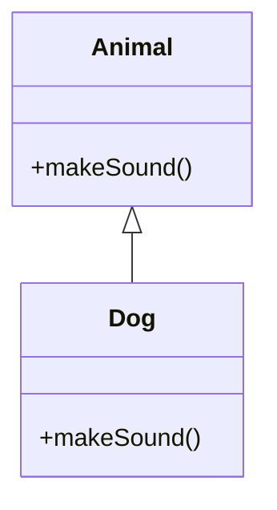

```cpp
class Animal {
public:
    virtual void makeSound() { cout << "..."; }
};
class Dog : public Animal {
public:
    void makeSound() override { cout << "Woof\n"; }
};
```

**Association** — `Bank` knows about `Employee`, but neither owns the other's lifetime the way whole-part does. Real rule of thumb used in this example: _Bank can exist without Employee, but Employee cannot exist without Bank_ — so this is actually leaning toward aggregation/dependency rather than pure symmetric association. Treat plain association as the loosest, most generic "one class uses another."

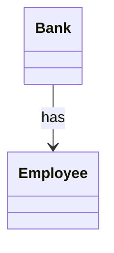

**Aggregation** — `Room` has `Sofa`, `Bed`, `Chair`, but each can exist independently of the Room (e.g. move the sofa to another room, it still exists):

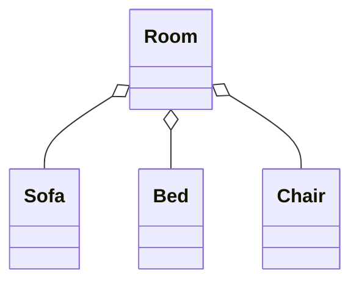

```cpp
class Sofa {};
class Bed {};
class Chair {};

class Room {
    // Room holds pointers/references — doesn't own their lifetime
    vector<Sofa*> sofas;
public:
    void addSofa(Sofa* s) { sofas.push_back(s); }
    // if Room is destroyed, the Sofa objects still exist elsewhere
};
```

**Composition** — `Chair` is made of `Arms`, `Seat`, `Wheels` — destroy the Chair, and these parts have no independent existence:

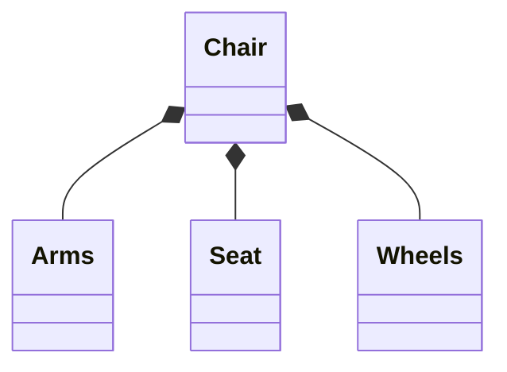

```cpp
class Arms {};
class Seat {};
class Wheels {};

class Chair {
    Arms* arms;
    Seat* seat;
    Wheels* wheels;
public:
    Chair() {
        arms = new Arms();
        seat = new Seat();
        wheels = new Wheels();
    }
    ~Chair() {
        // owned parts destroyed with the whole
        delete arms;
        delete seat;
        delete wheels;
    }
};
```

**Interview tell:** if you're not sure whether something is aggregation or composition, ask "if I delete the container object right now, does this part still make sense on its own?" Yes → aggregation. No → composition. This distinction directly affects whether you use raw pointers/references (aggregation) or manage the object's lifetime internally, e.g. with `unique_ptr` (composition).

### 2.3 More examples — from problems you'll actually build

These same 4 relationships show up constantly once we start Parking Lot, Library Management, Splitwise, etc. Seeing them ahead of time makes those problems much less overwhelming later.

**Inheritance — `Vehicle` hierarchy (Parking Lot problem):**

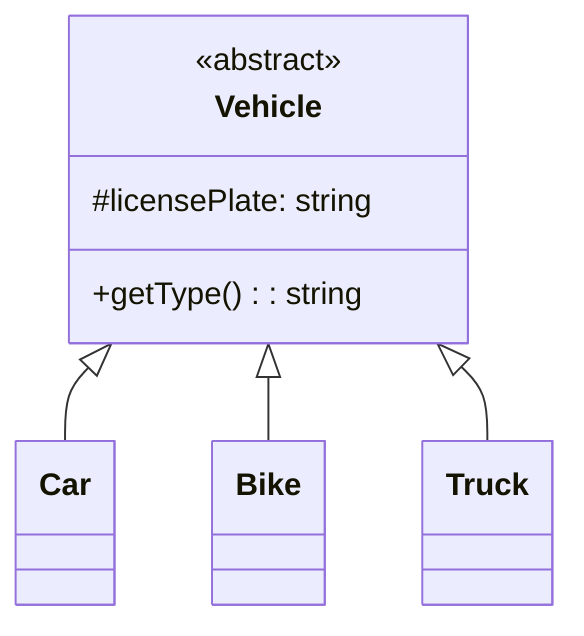

Every parking lot problem starts here — `Car`, `Bike`, `Truck` all _are_ vehicles, so inheritance is the right call (unlike the Penguin/Bird trap from Part 1 — there's no vehicle here that can't do what a Vehicle does).

**Association — `Driver` and `Car` (weak, symmetric "uses"):**

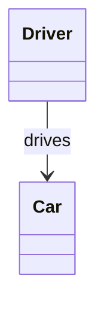

```cpp
class Car {};
class Driver {
    Car* currentCar; // just a reference, doesn't own it
public:
    void drive(Car* c) { currentCar = c; }
};
```

Neither owns the other's lifetime — a `Driver` can exist without a `Car` (walking), and a `Car` can exist without this particular `Driver` (someone else drives it tomorrow). This is the cleanest example of pure association — better than the Bank/Employee one from before.

**Aggregation — `Library` and `Book` (Library Management problem):**

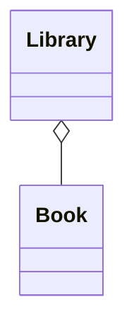

A `Book` can exist (physically, and as an object in your system — e.g. moved to another branch, or exists in an author's catalog independent of any library) even if a particular `Library` is shut down. `Library` just _holds_ books, doesn't fundamentally own their existence.

**Composition — `Car` and `Engine`, or `Order` and `OrderLineItem` (Splitwise-style problems):**

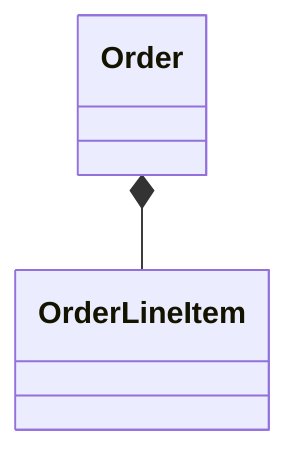

```cpp
class OrderLineItem {
public:
    string itemName;
    double amount;
};

class Order {
    vector<OrderLineItem> items; // owned by value — destroyed with Order automatically
public:
    void addItem(string name, double amt) {
        items.push_back({name, amt});
    }
};
```

An `OrderLineItem` has no meaning outside its `Order` — you'd never see one floating around independently. Notice this composition example doesn't even need manual `new`/`delete`: storing by value (`vector<OrderLineItem>`) is often the more natural C++ way to express composition, versus the pointer-based `Chair`/`Arms` example earlier where parts happened to be separate allocatable classes.

---

### 2.4 Sequence Diagram — behavior over time

Shows how objects **communicate**, and in **what order**, for one specific use case (not the whole system).

**Core elements:**

| Element              | Notation                                                    | Meaning                                                 |
| -------------------- | ----------------------------------------------------------- | ------------------------------------------------------- |
| Object               | rectangle at top                                            | a participant in the interaction                        |
| Lifeline             | dashed vertical line                                        | the object's existence over time                        |
| Activation bar       | thin rectangle on lifeline                                  | object is actively doing something right now            |
| Synchronous message  | solid arrow, filled head                                    | sender **waits** for receiver to finish                 |
| Asynchronous message | solid arrow, open head                                      | sender does **not** wait, continues immediately         |
| Return/response      | dashed arrow, open head                                     | receiver sends result back                              |
| Create message       | solid arrow → filled head, points at new object             | object instantiated during the interaction              |
| Destroy message      | solid arrow → filled head, points at object being destroyed | object destroyed during interaction                     |
| Lost message         | arrow ending in a dot                                       | sent but never received (receiver not active/reachable) |
| Found message        | arrow starting from a dot                                   | received, but sender is unknown/not modeled             |
| `alt`                | frame                                                       | if/else branching                                       |
| `opt`                | frame                                                       | if (no else)                                            |
| `loop`               | frame                                                       | for/while repetition                                    |

**Worked example — ATM withdrawal** (matches what you diagrammed):

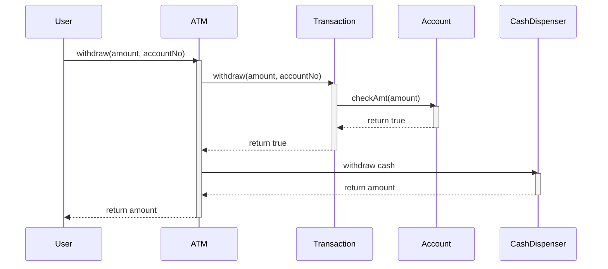

**How to approach building one (generalized):**

1. Nail down the use case flow in plain English first (e.g. "user withdraws cash from ATM").
2. Identify the objects involved — here: `User`, `ATM`, `Transaction`, `Account`, `CashDispenser`.
3. Draw lifelines for each, then add messages in the order they'd actually be called, with activation bars showing who's "busy" at each point.

**Interview relevance:** you won't usually be asked to draw a full sequence diagram from scratch in a 45-minute LLD round, but interviewers do expect you to **verbally walk through** the sequence of calls for at least one core use case after you've drawn the class diagram — this is exactly that skill, just spoken instead of drawn.

---

## Part 3: SOLID Principles

### Why design principles matter

Skipping these doesn't break your code today — it breaks it in 3 months. The concrete costs:

- **Maintainability issues** — small changes ripple into unrelated places, technical debt compounds
- **Reduced readability** — a class doing five things forces every reader to hold all five in their head
- **Bugs that take forever to debug** — because the "one reason to change" isn't obvious anymore, a fix in one area silently breaks another

---

### 3.1 Single Responsibility Principle (SRP)

**Definition:** A class should have only one reason to change.

**Beyond the definition:** "One reason to change" doesn't mean "one method." A class can have several methods and still satisfy SRP, as long as they all serve the _same actor/concern_. The real test: if you describe the class's job and your sentence needs an "**and**" joining two unrelated concerns ("handles cart items **and** prints invoices **and** talks to the database"), that's 3 reasons to change, not 1 — a change in the DB schema, a change in invoice formatting, and a change in cart logic would each force you to edit the same class.

**TV remote analogy :** a remote should control the TV — not the TV _and_ the AC _and_ the soundbar. If Samsung changes their AC protocol, your TV remote class shouldn't need a rebuild.

**Violated — `ShoppingCart` doing cart logic + printing + persistence:**

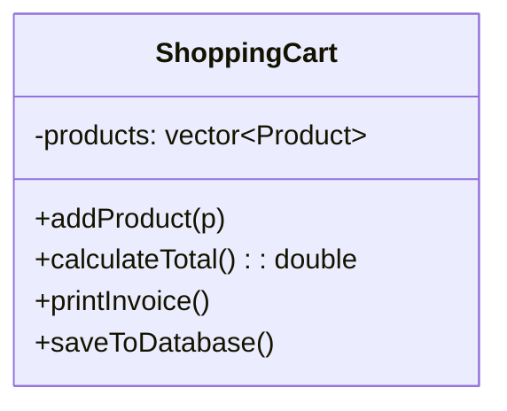

```cpp
class ShoppingCart {
    vector<Product*> products;
public:
    void addProduct(Product* p) { products.push_back(p); }
    double calculateTotal() { /* sums prices */ }

    // Violation #1: printing is a presentation concern, not cart logic
    void printInvoice() {
        cout << "Shopping Cart Invoice:\n";
        for (auto p : products) cout << p->name << " - Rs " << p->price << endl;
        cout << "Total: Rs " << calculateTotal() << endl;
    }
    // Violation #2: persistence is an infrastructure concern
    void saveToDatabase() {
        cout << "Saving shopping cart to database..." << endl;
    }
};
```

Three actors care about this one class: whoever owns cart business rules, whoever owns invoice formatting, whoever owns the DB layer. Any of them changing their part means touching `ShoppingCart`.

**Followed — split by actor/responsibility:**

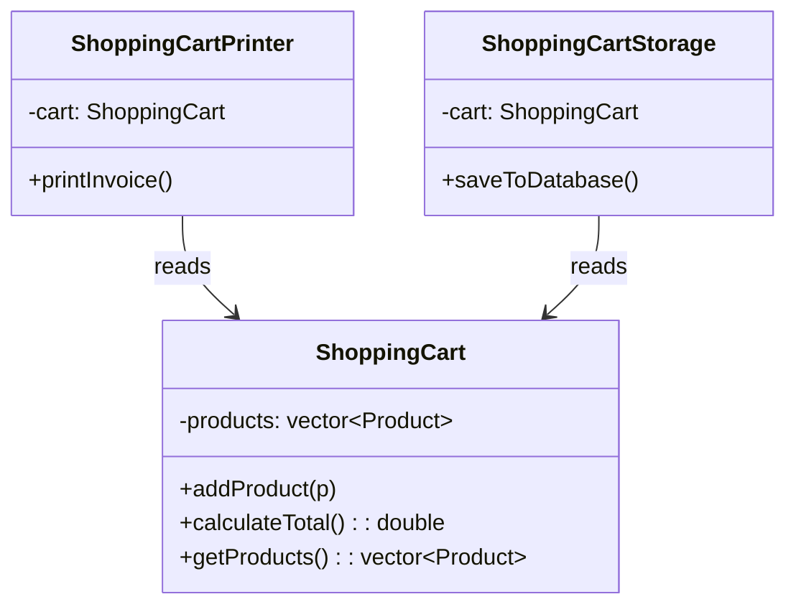

```cpp
class ShoppingCart {
    vector<Product*> products;
public:
    void addProduct(Product* p) { products.push_back(p); }
    const vector<Product*>& getProducts() { return products; }
    double calculateTotal() { /* sums prices */ }
};

class ShoppingCartPrinter {
    ShoppingCart* cart;
public:
    ShoppingCartPrinter(ShoppingCart* c) : cart(c) {}
    void printInvoice() { /* uses cart->getProducts(), cart->calculateTotal() */ }
};

class ShoppingCartStorage {
    ShoppingCart* cart;
public:
    ShoppingCartStorage(ShoppingCart* c) : cart(c) {}
    void saveToDatabase() { cout << "Saving shopping cart to database..." << endl; }
};
```

Now `ShoppingCartPrinter` and `ShoppingCartStorage` each _depend on_ `ShoppingCart` via association (not inheritance) — notice this is the same association relationship from Part 2, just applied to a real design decision instead of an abstract Bank/Employee example.

**Interview signal:** if you catch yourself writing "and" while explaining what a class does, or the class has methods that would live in entirely different modules of a real system (DB, formatting, business logic), split it.

---

### 3.2 Open/Closed Principle (OCP)

**Definition:** A class should be open for extension, but closed for modification.

**Beyond the definition:** "Closed for modification" doesn't mean "never touch this file again" — it means adding a new capability shouldn't require editing and re-testing code that already works and is already deployed. "Open for extension" is the escape hatch: you achieve it by coding against an abstraction (interface/abstract class) so new behavior arrives as a **new class**, not a new `if/else` branch in an old one.

**Violated — new storage type means editing `ShoppingCartStorage` every time:**

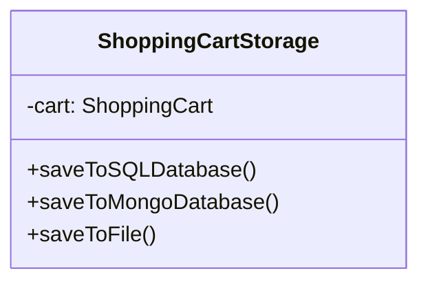

```cpp
class ShoppingCartStorage {
    ShoppingCart* cart;
public:
    void saveToSQLDatabase()   { cout << "Saving to SQL DB..." << endl; }
    void saveToMongoDatabase() { cout << "Saving to Mongo DB..." << endl; }
    void saveToFile()          { cout << "Saving to File..." << endl; }
    // adding Redis support next month means editing this class again
};
```

**Followed — `Persistence` abstraction, new backend = new subclass, zero edits to existing code:**

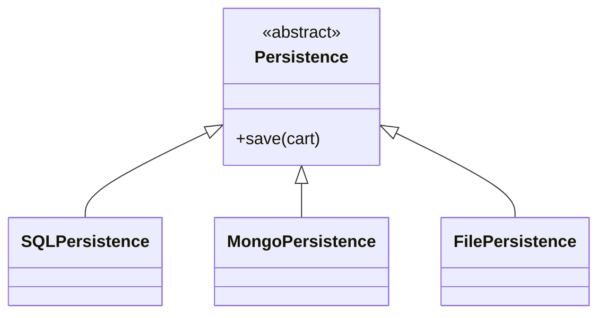

```cpp
class Persistence {
public:
    virtual void save(ShoppingCart* cart) = 0;
};
class SQLPersistence : public Persistence {
public:
    void save(ShoppingCart* cart) override { cout << "Saving to SQL DB..." << endl; }
};
class MongoPersistence : public Persistence {
public:
    void save(ShoppingCart* cart) override { cout << "Saving to MongoDB..." << endl; }
};
class FilePersistence : public Persistence {
public:
    void save(ShoppingCart* cart) override { cout << "Saving to a file..." << endl; }
};
// Redis support next month = write RedisPersistence, done. Persistence untouched.
```

This is the **same shape** as the `IPaymentStrategy` example from Part 1 (CreditCard/UPI/Wallet) — OCP in practice is almost always "turn a branching method into an interface + one subclass per branch." That's also literally the **Strategy pattern**, which we'll name properly once we get to design patterns.

**Interview signal:** if you're describing your design and say "and then if it's type X we do this, if it's type Y we do that" — stop, that's OCP being violated in real time. Ask "what if a new type shows up?" If the answer involves editing an existing class, it's not closed for modification yet.

---

### 3.3 Liskov Substitution Principle (LSP)

**Definition:** Subclasses should be substitutable for their base class — anywhere code expects a `Base*`, passing a `Derived*` should work without surprises.

**Beyond the definition:** LSP isn't "does it compile" — it's **behavioral**. A subclass shouldn't strengthen preconditions (demand more than the base promised), weaken postconditions (deliver less than the base promised), or throw for operations the base class advertised as safe. The practical interview test: **if client code needs `typeid`/`dynamic_cast`/`instanceof` checks, or if calling an inherited method can throw "not supported," LSP is already broken** — even if the code technically compiles and runs.

**Violated — `FixedTermAccount` inherits `withdraw()` it can't honestly support:**

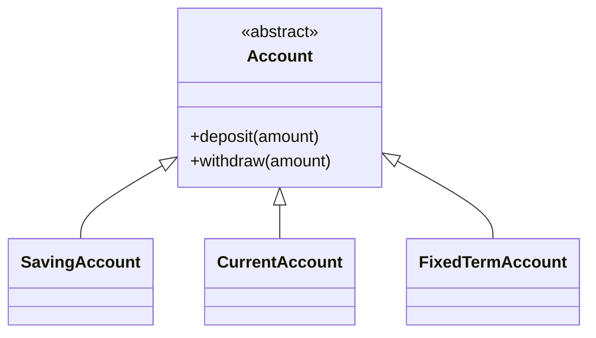

```cpp
class Account {
public:
    virtual void deposit(double amount) = 0;
    virtual void withdraw(double amount) = 0;
};
class FixedTermAccount : public Account {
    double balance;
public:
    void deposit(double amount) { balance += amount; }
    void withdraw(double amount) {
        throw logic_error("Withdrawal not allowed in Fixed Term Account!");
    }
};

// Client is forced to know about the exception — or worse, type-check:
class BankClient {
    vector<Account*> accounts;
public:
    void processTransactions() {
        for (Account* acc : accounts) {
            acc->deposit(1000);
            if (typeid(*acc) == typeid(FixedTermAccount)) {
                cout << "Skipping withdrawal for Fixed Term Account.\n"; // <- LSP smell
            } else {
                try { acc->withdraw(500); }
                catch (const logic_error& e) { cout << "Exception: " << e.what() << endl; }
            }
        }
    }
};
```

The moment `BankClient` needs `typeid` to know which accounts are "safe" to call `withdraw()` on, `FixedTermAccount` has failed to honestly be an `Account` — the abstraction lied.

**Followed — split the interface so the hierarchy only promises what every member can actually do:**

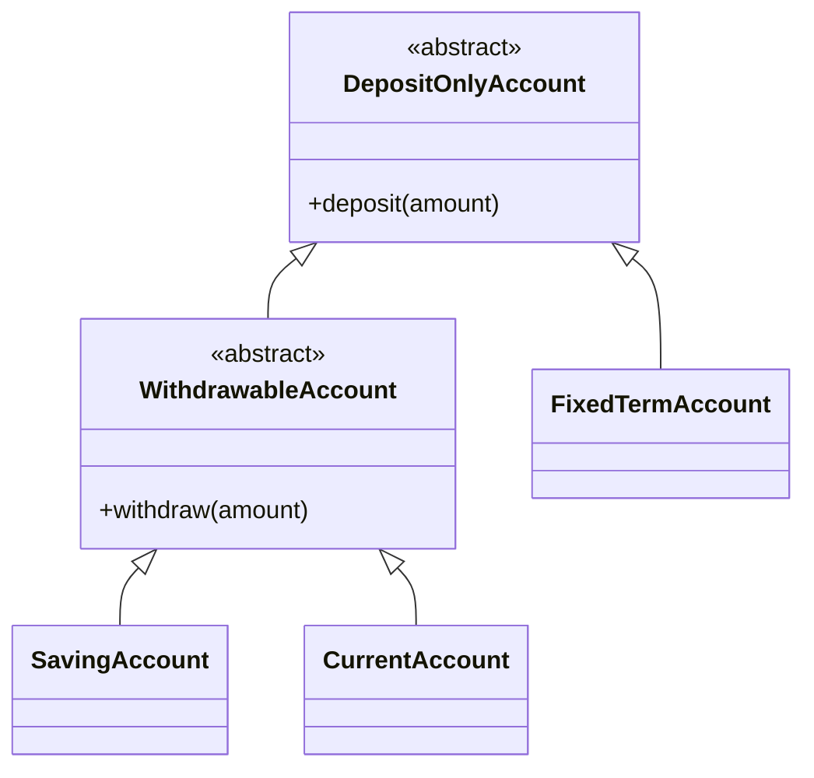

```cpp
class DepositOnlyAccount {
public:
    virtual void deposit(double amount) = 0;
};
class WithdrawableAccount : public DepositOnlyAccount {
public:
    virtual void withdraw(double amount) = 0;
};
class SavingAccount : public WithdrawableAccount { /* deposit + withdraw, both honest */ };
class CurrentAccount : public WithdrawableAccount { /* deposit + withdraw, both honest */ };
class FixedTermAccount : public DepositOnlyAccount { /* only deposit — never promises withdraw */ };

class BankClient {
    vector<WithdrawableAccount*> withdrawableAccounts;
    vector<DepositOnlyAccount*> depositOnlyAccounts;
public:
    void processTransactions() {
        for (auto* acc : withdrawableAccounts) { acc->deposit(1000); acc->withdraw(500); }
        for (auto* acc : depositOnlyAccounts)   { acc->deposit(5000); }
        // no typeid, no try/catch for "unsupported operation" — every call is honest
    }
};
```

No `typeid`, no `try/catch` for "this type doesn't actually support this." Every reference in `withdrawableAccounts` can genuinely withdraw; every reference in `depositOnlyAccounts` only promises deposit.

**Worth noticing:** the fix for LSP here — splitting one fat interface into `DepositOnlyAccount` + `WithdrawableAccount` — is _also_ a preview of **Interface Segregation Principle** (next up). LSP and ISP violations often show up together: a fat interface tends to force some subclass into breaking substitutability.

**Interview signal:** whenever you're about to override a method just to throw `NotImplementedException`/`logic_error`, stop — that's the clearest LSP red flag there is. It means the base class promised something this subclass can't deliver, and the fix is almost always to split the interface rather than "handle" the exception downstream.

#### 3.3.1 The 4 formal LSP sub-rules

The `Account` example is the "big picture" violation. Real LSP checking goes one level deeper, into 4 concrete rules — these are what an interviewer is actually checking when they ask "is this a good `is-a` relationship?"

**Rule 1 — Signature / method argument rule (contravariance):** an overriding method's parameter types must be the **same or broader** (a supertype) than the parent's. It can accept _more_ than the parent promised to accept, never less.

**Rule 2 — Return type rule (covariance):** an overriding method's return type must be the **same or narrower** (a subtype) than the parent's. It can promise to give back something _more specific_, never something looser.

_(Rules 1 & 2 are less commonly hand-coded as violations in interviews since C++ won't even compile a signature mismatch as a valid override — but understanding contravariance/covariance is exactly why virtual function signatures must match the base class precisely, and it comes up if you discuss return-type covariance in C++ with pointers/references to derived types.)_

**Rule 3 — Exception rule:** if the parent method can throw exception type `E`, the child's override must throw `E` or a **narrower/more specific** exception — never a new, broader, or unrelated one the client wasn't expecting.

**Rule 4 — Property rule (invariants + history constraint):**

- **Class invariant** — a condition that must hold true for _every_ object of the class, always. If `Account` guarantees "balance is never negative," a subclass can strengthen that (e.g. "balance is never below ₹500") but never break it.
- **History constraint** — a rule about state _over time_ that the parent guarantees must keep holding in the child. Example: if the parent says "withdrawal is always possible" or "this field is immutable once set," the child can't silently make it false or mutable — that breaks client assumptions about how the object behaves across its lifetime, not just at one point in time. This is exactly what happened with `FixedTermAccount` above: `Account` implicitly promised withdrawal was always a valid operation, and `FixedTermAccount` broke that history constraint.

**Rule 5 — Method rule (precondition + postcondition):**

**Precondition** — a condition that must hold _before_ a method runs. A child override can **weaken** (relax) the precondition or keep it the same, but never **strengthen** (add more restrictions) — because that would break a client that was relying on the parent's looser contract.

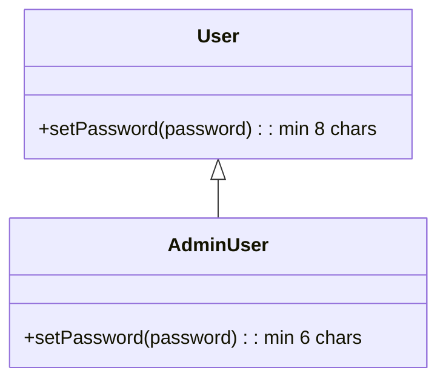

```cpp
class User {
public:
    // Precondition: password must be >= 8 characters
    virtual void setPassword(string password) {
        if (password.length() < 8)
            throw invalid_argument("Password must be at least 8 characters long!");
        cout << "Password set successfully" << endl;
    }
};

class AdminUser : public User {
public:
    // Precondition WEAKENED to >= 6 characters — allowed, doesn't break LSP
    void setPassword(string password) override {
        if (password.length() < 6)
            throw invalid_argument("Password must be at least 6 characters long!");
        cout << "Password set successfully" << endl;
    }
};

int main() {
    User* user = new AdminUser();
    user->setPassword("Admin1"); // 6 chars — works, even though base User "seems" to require 8
}
```

Any code written against `User` assumed passwords need _at least_ 8 characters. `AdminUser` accepting a 6-character password never violates that assumption — it's _more permissive_, so nothing that worked against `User` can break against `AdminUser`. If `AdminUser` instead demanded 10+ characters (strengthening), a client that tested "8-char password works" against `User` would break when substituting in `AdminUser` — **that** would violate LSP.

**Postcondition** — a condition that must hold _after_ a method finishes. A child override can **strengthen** it (guarantee more) or keep it the same, but never **weaken** it (guarantee less) — because a client relying on the parent's guarantee would get less than promised.

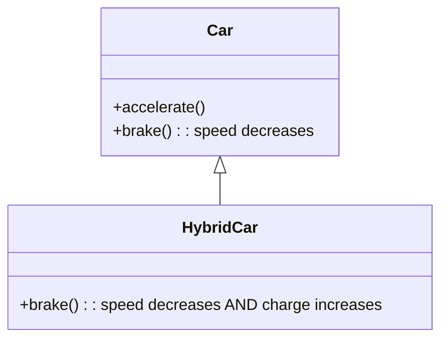

```cpp
class Car {
protected:
    int speed = 0;
public:
    void accelerate() { speed += 20; }
    // Postcondition: speed must decrease after brake()
    virtual void brake() { speed -= 20; }
};

class HybridCar : public Car {
private:
    int charge = 0;
public:
    // Postcondition STRENGTHENED: speed still decreases, AND charge now increases too
    void brake() override {
        speed -= 20;
        charge += 10;
    }
};

int main() {
    Car* hybridCar = new HybridCar();
    hybridCar->brake(); // speed still drops as promised, charge is a bonus guarantee
    // Client substituting HybridCar in place of Car sees no broken behavior — only extra benefit
}
```

The base `Car` only promised "speed decreases." `HybridCar` still honors that _and_ adds an extra guarantee (charge increases). A client that only cares about the `Car` contract never notices or breaks — that's a safe, LSP-compliant strengthening. Weakening would look like a `HybridCar::brake()` that _doesn't_ reduce speed, or only reduces it sometimes — that would break every client relying on the base guarantee.

**Quick-reference table for the 4 rules:**

| Rule               | Child can...                               | Child must NOT...                                                                       |
| ------------------ | ------------------------------------------ | --------------------------------------------------------------------------------------- |
| Method arguments   | accept broader/same types (contravariance) | narrow the accepted types                                                               |
| Return type        | return narrower/same types (covariance)    | return a broader/unrelated type                                                         |
| Exceptions         | throw the same or a narrower exception     | throw a new, broader, unrelated exception                                               |
| Invariant          | strengthen (add more guarantees)           | break an existing guarantee                                                             |
| History constraint | preserve state guarantees over time        | make something mutable/unavailable that the parent promised was always stable/available |
| Precondition       | weaken or keep the same                    | strengthen (add more restrictions)                                                      |
| Postcondition      | strengthen or keep the same                | weaken (guarantee less)                                                                 |

**Interview signal (refined):** you don't need to recite all 5 rules by name in an interview — but if you're deciding whether a subclass override is "safe," running it through **"does this ask for more, or promise less, than the parent did?"** covers precondition/postcondition/exception in one gut-check.

---

### 3.4 Interface Segregation Principle (ISP)

**Definition:** Many client-specific interfaces are better than one general-purpose interface. Clients should not be forced to implement (or depend on) methods they don't need.

**Beyond the definition:** ISP is really "LSP prevention at the design stage." If you'd already split fat interfaces before writing any subclass, you'd never end up needing a `logic_error("not supported")` override in the first place — which is exactly what happened with `WithdrawableAccount`/`DepositOnlyAccount` earlier. ISP is the _proactive_ version of the fix LSP forces on you _reactively_.

**Violated — one `Shape` interface forces every shape to implement `volume()`, even flat ones:**

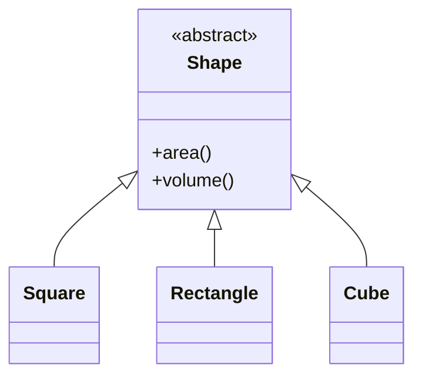

```cpp
class Shape {
public:
    virtual double area() = 0;
    virtual double volume() = 0; // 2D shapes don't have volume!
};

class Square : public Shape {
    double side;
public:
    Square(double s) : side(s) {}
    double area() override { return side * side; }
    double volume() override {
        throw logic_error("Volume not applicable for Square"); // forced, unnecessary method
    }
};

class Cube : public Shape {
    double side;
public:
    Cube(double s) : side(s) {}
    double area() override { return 6 * side * side; }
    double volume() override { return side * side * side; }
};

int main() {
    Shape* square = new Square(5);
    try {
        cout << square->volume() << endl; // throws — Square was never a 3D shape
    } catch (logic_error& e) {
        cout << "Exception: " << e.what() << endl;
    }
}
```

Notice this is the _exact same smell_ as the `FixedTermAccount::withdraw()` LSP violation — a fat base interface forcing a method that doesn't semantically belong.

**Followed — split into `TwoDimensionalShape` and `ThreeDimensionalShape`:**

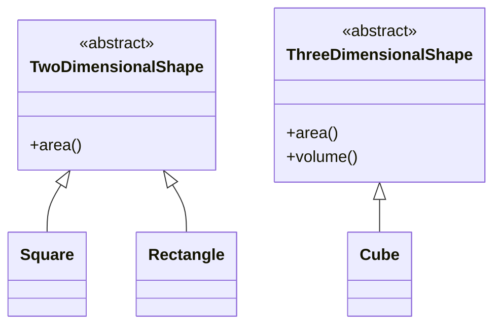

```cpp
class TwoDimensionalShape {
public:
    virtual double area() = 0;
};
class ThreeDimensionalShape {
public:
    virtual double area() = 0;
    virtual double volume() = 0;
};

class Square : public TwoDimensionalShape {
    double side;
public:
    Square(double s) : side(s) {}
    double area() override { return side * side; }
};
class Cube : public ThreeDimensionalShape {
    double side;
public:
    Cube(double s) : side(s) {}
    double area() override { return 6 * side * side; }
    double volume() override { return side * side * side; }
};
```

`Square` only ever depends on the interface it actually needs. No `logic_error`, no forced method, no lying about capability.

**Interview signal:** if an interface has methods that only _some_ implementers use, and the rest either throw, return a dummy value, or leave it empty — that interface needs to be split. Fat interfaces are usually the _root cause_ of LSP violations you'll spot later.

---

### 3.5 Dependency Inversion Principle (DIP)

**Definition:** High-level modules should not depend on low-level modules — both should depend on abstractions. (Related but distinct from _dependency injection_, which is just one common technique to achieve DIP.)

**Beyond the definition:** "High-level" means the module containing your actual business logic (e.g. `UserService`); "low-level" means implementation details (e.g. a specific database driver). Without DIP, your business logic is welded to one specific implementation — swapping databases means editing the class that contains your core logic, which is risky precisely because that's the class you can least afford to break.

**Violated — `UserService` directly depends on concrete `MySQLDatabase` and `MongoDBDatabase`:**

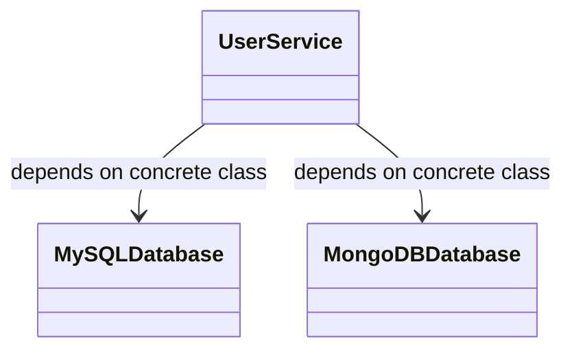

```cpp
class MySQLDatabase {
public:
    void saveToSQL(string data) { cout << "INSERT INTO users VALUES('" << data << "');" << endl; }
};
class MongoDBDatabase {
public:
    void saveToMongo(string data) { cout << "db.users.insert({name: '" << data << "'})" << endl; }
};

class UserService { // high-level module, tightly coupled to low-level details
    MySQLDatabase sqlDb;
    MongoDBDatabase mongoDb;
public:
    void storeUserToSQL(string user)   { sqlDb.saveToSQL(user); }
    void storeUserToMongo(string user) { mongoDb.saveToMongo(user); }
    // adding PostgreSQL means editing UserService itself — your core business logic class
};
```

`UserService` — the class holding your actual business logic — has to change every time a new database shows up. That's backwards: the important, stable class should be the _last_ thing that needs edits.

**Followed — both `UserService` and the DB implementations depend on a `Database` abstraction:**

```mermaid
classDiagram
    Database <|-- MySQLDatabase
    Database <|-- MongoDBDatabase
    UserService --> Database : depends on abstraction
    class Database {
        <<abstract>>
        +save(data)
    }
```

```cpp
class Database {
public:
    virtual void save(string data) = 0;
};
class MySQLDatabase : public Database {
public:
    void save(string data) override { cout << "INSERT INTO users VALUES('" << data << "');" << endl; }
};
class MongoDBDatabase : public Database {
public:
    void save(string data) override { cout << "db.users.insert({name: '" << data << "'})" << endl; }
};

class UserService { // high-level module, now depends only on the abstraction
    Database* db;
public:
    UserService(Database* database) : db(database) {} // dependency injected via constructor
    void storeUser(string user) { db->save(user); }
};

int main() {
    MySQLDatabase mysql;
    MongoDBDatabase mongodb;
    UserService service1(&mysql);
    service1.storeUser("Aditya");
    UserService service2(&mongodb);
    service2.storeUser("Rohit");
}
```

`UserService` no longer knows _or cares_ whether it's talking to MySQL, MongoDB, or (later) Redis — that decision is made once, at construction time, from outside. Adding a new DB means writing `RedisDatabase : public Database`; `UserService` is never touched again.

**Worth noticing — this ties every SOLID principle together:** `Database` is an abstraction reached via **OCP** (new backend = new subclass, no edits), the subclasses are all safely substitutable per **LSP** (none of them throw "not supported" for `save()`), and the interface only has the one method every implementer genuinely needs, per **ISP**. DIP is often described as "the glue principle" for exactly this reason — get D right and the other four tend to already be in place.

**Interview signal:** if you ever see a high-level/business-logic class with `new ConcreteThing()` written directly inside it (instead of receiving an abstraction through the constructor or a setter), that's DIP being violated in the most common, recognizable way.

---

## Part 4: Design Patterns

Patterns are named, reusable solutions to recurring design problems. You've actually already built several of these without the name — e.g. the `Persistence`/`IPaymentStrategy` examples from OCP were Strategy all along. This section names them properly, but always starts from _why_, not just _what_.

### 4.1 Strategy Pattern

**Definition:** Defines a family of interchangeable algorithms/behaviors, encapsulates each one in its own class, and lets the client swap between them at runtime without changing the class that uses them.

#### Why this pattern exists — the bad design first

Say you're building a `Robot` class: robots vary along 3 independent dimensions — can it walk, can it talk, can it fly. Two naive approaches, both bad:

**Bad approach #1 — boolean flags + if/else inside `Robot`:**

```mermaid
classDiagram
    class Robot {
        -canWalk: bool
        -canTalk: bool
        -canFly: bool
        +walk()
        +talk()
        +fly()
    }
```

```cpp
class Robot {
    bool canWalk, canTalk, canFly;
public:
    Robot(bool w, bool t, bool f) : canWalk(w), canTalk(t), canFly(f) {}

    void walk() {
        if (canWalk) cout << "Walking normally..." << endl;
        else cout << "Cannot walk." << endl;
    }
    void talk() {
        if (canTalk) cout << "Talking normally..." << endl;
        else cout << "Cannot talk." << endl;
    }
    void fly() {
        if (canFly) cout << "Flying normally..." << endl;
        else cout << "Cannot fly." << endl;
    }
    // New requirement: "some robots fly with jets, some with wings"?
    // Now you need canFly AND flyType, and every method grows another if/else branch.
};
```

This compiles fine and even looks reasonable at 3 behaviors. The failure shows up under _change_: the moment you need a 3rd variant of any behavior (not just yes/no, but "flies with wings" vs "flies with jet"), every method's `if/else` has to grow — **OCP violated**, because supporting a new behavior variant means editing `Robot` itself, the class everything else depends on.

**Bad approach #2 — inheritance per combination:**

```mermaid
classDiagram
    Robot <|-- WalkingTalkingFlyingRobot
    Robot <|-- WalkingTalkingRobot
    Robot <|-- SilentFlyingRobot
    Robot <|-- WalkingOnlyRobot
```

The instinct to "just make a subclass for each kind of robot" seems reasonable until you realize 3 independent yes/no behaviors already need up to 2³ = 8 subclasses — and every new behavior _dimension_ (not even a new variant, a whole new dimension like "can swim") **doubles** that number again.

**Both bad approaches share the same root cause:** behavior that varies is welded directly into the class instead of being pulled out and composed in.

#### The fix — Strategy

The core move: identify what _varies_ (walk, talk, fly), give each its own interface, write one small concrete class per variant, and have `Robot` hold a _reference_ to each interface (composition) instead of implementing the behavior or inheriting a fixed combination of it.

**Key components:**

- **Strategy interface** per varying behavior (`WalkableRobot`, `TalkableRobot`, `FlyableRobot`) — each declares one method
- **Concrete strategies** implementing each variant (`NormalWalk`/`NoWalk`, `NormalTalk`/`NoTalk`, `NormalFly`/`NoFly`)
- **Context** (`Robot`) — holds references to strategy objects via composition, delegates calls, never implements the varying behavior itself

```mermaid
classDiagram
    Robot o-- WalkableRobot
    Robot o-- TalkableRobot
    Robot o-- FlyableRobot
    WalkableRobot <|-- NormalWalk
    WalkableRobot <|-- NoWalk
    TalkableRobot <|-- NormalTalk
    TalkableRobot <|-- NoTalk
    FlyableRobot <|-- NormalFly
    FlyableRobot <|-- NoFly
    Robot <|-- CompanionRobot
    Robot <|-- WorkerRobot

    class WalkableRobot { <<abstract>> +walk() }
    class TalkableRobot { <<abstract>> +talk() }
    class FlyableRobot { <<abstract>> +fly() }
    class Robot {
        <<abstract>>
        #walkBehavior: WalkableRobot
        #talkBehavior: TalkableRobot
        #flyBehavior: FlyableRobot
        +walk()
        +talk()
        +fly()
        +projection()*
    }
```

```cpp
class WalkableRobot {
public:
    virtual void walk() = 0;
    virtual ~WalkableRobot() {}
};
class NormalWalk : public WalkableRobot {
public:
    void walk() override { cout << "Walking normally..." << endl; }
};
class NoWalk : public WalkableRobot {
public:
    void walk() override { cout << "Cannot walk." << endl; }
};
// TalkableRobot / FlyableRobot follow the exact same shape (NormalTalk/NoTalk, NormalFly/NoFly)

class Robot {
protected:
    WalkableRobot* walkBehavior;
    TalkableRobot* talkBehavior;
    FlyableRobot* flyBehavior;
public:
    Robot(WalkableRobot* w, TalkableRobot* t, FlyableRobot* f)
        : walkBehavior(w), talkBehavior(t), flyBehavior(f) {}
    void walk() { walkBehavior->walk(); }   // delegates, doesn't implement
    void talk() { talkBehavior->talk(); }
    void fly()  { flyBehavior->fly(); }
    virtual void projection() = 0;
};

class CompanionRobot : public Robot {
public:
    CompanionRobot(WalkableRobot* w, TalkableRobot* t, FlyableRobot* f) : Robot(w, t, f) {}
    void projection() override { cout << "Displaying friendly companion features..." << endl; }
};
class WorkerRobot : public Robot {
public:
    WorkerRobot(WalkableRobot* w, TalkableRobot* t, FlyableRobot* f) : Robot(w, t, f) {}
    void projection() override { cout << "Displaying worker efficiency stats..." << endl; }
};

int main() {
    // Mix and match freely — no new class needed per combination
    Robot* robot1 = new CompanionRobot(new NormalWalk(), new NormalTalk(), new NoFly());
    robot1->walk(); robot1->talk(); robot1->fly(); robot1->projection();

    Robot* robot2 = new WorkerRobot(new NoWalk(), new NoTalk(), new NormalFly());
    robot2->walk(); robot2->talk(); robot2->fly(); robot2->projection();
}
```

**Why this actually fixes both bad approaches:** a new fly variant (`FlyWithJet`) is one new class implementing `FlyableRobot` — zero edits to `Robot`, zero new subclasses, zero growing `if/else`. The 8-subclass explosion collapses to 2 robot _types_ (`CompanionRobot`, `WorkerRobot`) × freely composable behaviors, because each dimension varies independently instead of multiplying combinatorially.

**Ties to what you already know:** `Robot` uses composition for its varying parts, not inheritance — same reasoning as Part 2. Each strategy interface has exactly one method — ISP. `Robot` depends on `WalkableRobot*`, not `NormalWalk` directly — DIP. New behavior = new class, not a new edit — OCP. Strategy isn't new rules; it's SOLID applied specifically to "behavior that varies."

**Interview signal:** if you catch yourself writing a boolean flag + `if/else` per behavior, _or_ reaching for a subclass per combination, stop and ask "is this actually a varying behavior that should be composed in in via an interface, injected at construction time?" If yes, that's Strategy — and saying this reasoning out loud (not just naming the pattern) is what actually demonstrates you understand it rather than memorized it.

#### The generic Strategy template

Every Strategy pattern implementation follows the same shape, regardless of domain — worth having this as the "template" you pattern-match new problems against:

```mermaid
classDiagram
    Client o-- Strategy : has a
    Strategy <|-- ConcreteStrategy
    class Strategy {
        <<abstract>>
        +run()
    }
    class Client {
        -strategy: Strategy
        +execute()
    }
    class ConcreteStrategy {
        +run()
    }
```

- **`Client`** — the context/host object. Holds a reference to `Strategy` (composition — "has a", not "is a"), and calls `execute()`, which internally delegates to `strategy->run()`.
- **`Strategy`** — the abstract interface declaring the one varying operation.
- **`ConcreteStrategy`** — one class per interchangeable variant; only this layer grows as new behaviors appear, `Client` never changes.

Map this onto the `Robot` example: `Robot` = `Client`, `WalkableRobot` = `Strategy`, `NormalWalk`/`NoWalk` = `ConcreteStrategy` instances. Same shape, different names.

#### Real-world examples (recognize the shape, not just the robot)

**Payment system:** `PaymentSystem` is the `Client`; `PaymentStrategy` is the abstract interface with `payNow()`; `UPI`, `CreditCard`, `DebitCard`, `NetBanking`, `Cash` are each a `ConcreteStrategy` overriding `payNow()` in their own way. Adding "add wallet support" next quarter = one new class, `PaymentSystem` untouched — same OCP guarantee as before.

**Sorting:** a `Sorter` class with a `sort()` method that delegates to a `SortStrategy` interface — `QuickSort`, `MergeSort`, `BubbleSort` as concrete strategies. This is literally how `std::sort`-style comparator injection and Java's `Comparator` work under the hood — Strategy isn't just an interview toy, it's load-bearing in real standard libraries.

**The recognition test going forward:** whenever a `Client`/context class needs to do "the same operation, but differently depending on X," ask whether X should be a `Strategy` — that single question covers payment methods, sorting, discount calculation, delivery-fee calculation, notification channels, and dozens of other LLD problems you haven't seen yet.

#### Core principles this pattern is built from

These aren't new — they're the same OOP/SOLID ideas from earlier parts, just named as standalone design mantras since you'll hear them again for every pattern going forward:

- **Encapsulate what varies** — isolate the part of your system likely to change into its own class, away from the parts that stay stable.
- **The solution to a bad inheritance hierarchy is not more inheritance** — this is the direct lesson from the "8-subclass explosion" bad design: adding more subclasses to fix a combinatorial problem only makes it worse.
- **Favor composition over inheritance** — `Client` _has a_ `Strategy`, it doesn't _is-a_ `Strategy`. This is the same has-a vs is-a distinction from Part 2's UML associations.
- **Code to an interface, not a concretion** — `Client` only ever holds a `Strategy*`, never a `ConcreteStrategy*` directly. This is DIP, restated.
- **DRY (Don't Repeat Yourself)** — shared logic lives once, in the strategy implementation being delegated to, not copy-pasted across every place that needs that behavior.

---

### 4.2 Factory Pattern

**Definition:** Separates _business logic_ from _object creation logic_. The client asks for what it needs; something else decides which concrete class to instantiate and hands back the finished object. The client never says `new ConcreteThing()` itself.

**Where this sits relative to Strategy:** Strategy assumes the object already exists and varies _how it behaves_. Factory doesn't care about behavior yet — it answers a question one step earlier: **which concrete object should even get created**. You'll often see both in the same system: a Factory creates a Strategy object, and the client later calls a method on it.

#### Why this pattern exists — the bad design first

```cpp
// Bad: object-creation logic scattered wherever a Burger is needed
class Client {
public:
    void orderBurger(string type) {
        Burger* burger;
        if (type == "basic") burger = new BasicBurger();
        else if (type == "standard") burger = new StandardBurger();
        else if (type == "premium") burger = new PremiumBurger();
        // Every place in the codebase that creates a burger repeats this if/else.
        // Adding "deluxe" means finding and editing all of them — OCP violated
        // everywhere at once, not just in one class.
        burger->prepare();
    }
};
```

The client is doing two unrelated jobs — deciding _what to order_ (business logic) and deciding _how to build it_ (construction logic). That's SRP violated too, and it gets worse the moment object creation is needed in more than one place.

#### 4.2.1 Simple Factory

Not officially one of the 23 GoF patterns — more of a common first step: pull the `if/else` out of the client into one dedicated factory class.

```mermaid
classDiagram
    BurgerFactory --> Burger : creates
    Burger <|-- BasicBurger
    Burger <|-- StandardBurger
    Burger <|-- PremiumBurger
    class Burger { <<abstract>> +prepare() }
    class BurgerFactory { +createBurger(type): Burger }
```

```cpp
class Burger {
public:
    virtual void prepare() = 0;
    virtual ~Burger() {}
};
class BasicBurger : public Burger {
public:
    void prepare() override { cout << "Preparing Basic Burger..." << endl; }
};
class StandardBurger : public Burger {
public:
    void prepare() override { cout << "Preparing Standard Burger..." << endl; }
};
class PremiumBurger : public Burger {
public:
    void prepare() override { cout << "Preparing Premium Burger..." << endl; }
};

class BurgerFactory {
public:
    Burger* createBurger(string& type) {
        if (type == "basic") return new BasicBurger();
        if (type == "standard") return new StandardBurger();
        if (type == "premium") return new PremiumBurger();
        cout << "Invalid burger type!" << endl;
        return nullptr;
    }
};

int main() {
    string type = "standard";
    BurgerFactory factory;
    Burger* burger = factory.createBurger(type);
    burger->prepare();
}
```

**What this fixes, and what it doesn't:** the client no longer knows _how_ burgers are built — that's real progress. But the `if/else` still exists, just relocated into `BurgerFactory`. Adding a new burger type still means editing this one class. That's fine for a single, stable product line — but it doesn't scale if you also need entirely different _families_ of creation logic (see Factory Method below).

#### 4.2.2 Factory Method

Makes the _factory itself_ abstract. Instead of one factory with an `if/else`, you get one factory **interface**, and each concrete factory owns its own creation logic — selecting _which factory_ to use becomes a polymorphism decision instead of a string check.

```mermaid
classDiagram
    BurgerFactory <|-- SinghBurger
    BurgerFactory <|-- KingBurger
    Burger <|-- BasicBurger
    Burger <|-- StandardBurger
    Burger <|-- PremiumBurger
    Burger <|-- BasicWheatBurger
    Burger <|-- StandardWheatBurger
    Burger <|-- PremiumWheatBurger
    BurgerFactory --> Burger : creates
    class BurgerFactory { <<abstract>> +createBurger(type): Burger }
    class Burger { <<abstract>> +prepare() }
```

```cpp
class BurgerFactory {
public:
    virtual Burger* createBurger(string& type) = 0;
};

class SinghBurger : public BurgerFactory {
public:
    Burger* createBurger(string& type) override {
        if (type == "basic") return new BasicBurger();
        if (type == "standard") return new StandardBurger();
        if (type == "premium") return new PremiumBurger();
        return nullptr;
    }
};
class KingBurger : public BurgerFactory {
public:
    Burger* createBurger(string& type) override {
        if (type == "basic") return new BasicWheatBurger();
        if (type == "standard") return new StandardWheatBurger();
        if (type == "premium") return new PremiumWheatBurger();
        return nullptr;
    }
};

int main() {
    string type = "basic";
    BurgerFactory* myFactory = new SinghBurger(); // pick the brand once, polymorphically
    Burger* burger = myFactory->createBurger(type);
    burger->prepare();
}
```

**Why this is a real improvement, not just extra indirection:** adding a whole new _brand_ (`JuniorBurger`) is now a new class implementing `BurgerFactory` — zero edits to `SinghBurger` or `KingBurger`. Each brand's size-based branching (`basic`/`standard`/`premium`) stays localized to its own factory, so a change to Singh's recipe logic can never accidentally touch King's. Simple Factory couldn't give you that isolation — everything lived in one class.

#### 4.2.3 Abstract Factory

Same idea as Factory Method, but the factory now creates a **family of related products**, not just one. One factory call site produces multiple objects that are meant to go together.

```mermaid
classDiagram
    MealFactory <|-- SinghBurger
    MealFactory <|-- KingBurger
    Burger <|-- BasicBurger
    Burger <|-- BasicWheatBurger
    GarlicBread <|-- BasicGarlicBread
    GarlicBread <|-- BasicWheatGarlicBread
    MealFactory --> Burger : creates
    MealFactory --> GarlicBread : creates
    class MealFactory {
        <<abstract>>
        +createBurger(type): Burger
        +createGarlicBread(type): GarlicBread
    }
```

```cpp
class Burger { public: virtual void prepare() = 0; };
class BasicBurger : public Burger { public: void prepare() override { cout << "Basic Burger\n"; } };
class BasicWheatBurger : public Burger { public: void prepare() override { cout << "Basic Wheat Burger\n"; } };

class GarlicBread { public: virtual void prepare() = 0; };
class BasicGarlicBread : public GarlicBread { public: void prepare() override { cout << "Basic Garlic Bread\n"; } };
class BasicWheatGarlicBread : public GarlicBread { public: void prepare() override { cout << "Basic Wheat Garlic Bread\n"; } };

class MealFactory {
public:
    virtual Burger* createBurger(string& type) = 0;
    virtual GarlicBread* createGarlicBread(string& type) = 0;
};

class SinghBurger : public MealFactory {
public:
    Burger* createBurger(string& type) override { return new BasicBurger(); /* + other types */ }
    GarlicBread* createGarlicBread(string& type) override { return new BasicGarlicBread(); }
};
class KingBurger : public MealFactory {
public:
    Burger* createBurger(string& type) override { return new BasicWheatBurger(); }
    GarlicBread* createGarlicBread(string& type) override { return new BasicWheatGarlicBread(); }
};

int main() {
    MealFactory* mealFactory = new KingBurger();
    string b = "basic", g = "basic";
    mealFactory->createBurger(b)->prepare();
    mealFactory->createGarlicBread(g)->prepare();
    // Picking KingBurger guarantees everything created is consistently "wheat family" —
    // impossible to accidentally mix a KingBurger patty with a Singh garlic bread.
}
```

**The real value here:** consistency across a _family_. Once you pick `KingBurger` as your factory, every product it creates belongs to the same family (wheat variants) automatically — you can't accidentally end up with mismatched products, because the factory itself is the thing enforcing that grouping.

#### Simple Factory vs Factory Method vs Abstract Factory — the actual difference

| Variant          | What decides the concrete class                          | Scope                                                                |
| ---------------- | -------------------------------------------------------- | -------------------------------------------------------------------- |
| Simple Factory   | One factory class, `if/else` by input                    | 1 product type                                                       |
| Factory Method   | Which concrete _factory subclass_ you use (polymorphism) | 1 product type, multiple "families"/brands                           |
| Abstract Factory | Which concrete _factory subclass_ you use                | Multiple related product types, created together as a consistent set |

#### Real-world example — Notification system

**As Factory:** `NotificationFactory` decides which concrete `Notification` object (`SMSNotification`, `PushNotification`, `EmailNotification`) to _instantiate_, based on user preference or event type, and hands it back to whoever asked.

**Your question — could this instead be Strategy?** Yes, genuinely — and this ambiguity is worth sitting with rather than resolving too quickly:

- If the concern is **"I already have a `NotificationSender`, and I just need to swap which channel it uses to `send()` a message"** — that's Strategy. The object exists; only the behavior varies.
- If the concern is **"depending on the event, I need to construct the right kind of `Notification` object in the first place, possibly to queue it, log it, or pass it somewhere else before anything is sent"** — that's Factory. The point in question is _which class gets instantiated_, not _what an existing object does_.

**In practice, they usually compose rather than compete:** a very common real design is `NotificationFactory` (Factory) that _creates_ a `NotificationStrategy` object (Strategy), which the caller then invokes `send()` on. Factory answers "which object do I get," Strategy answers "what does that object do when called" — they're solving adjacent problems, not the same one, which is exactly why they show up together so often.

**Interview signal:** if you're debating "is this Strategy or Factory," ask _what's actually varying_. If it's "how an operation behaves" → Strategy. If it's "which concrete class to instantiate, decoupled from where it's used" → Factory. If both questions apply to the same problem at different points, that's not a contradiction — use both.

---

### 4.3 Singleton Pattern

**Definition:** Ensures a class has exactly one instance across the entire program, and provides a single global access point to it. Every call to get an instance of this class returns the _same_ object, never a new one.

#### The mechanics worth understanding first — stack vs heap

Before the pattern itself, the stack/heap distinction you noted is worth locking in, since it's _why_ Singleton needs a pointer + static storage at all:

```cpp
A* a = new A();
```

- `new A()` allocates the actual `A` object on the **heap** and runs `A`'s constructor.
- `a` itself — the pointer/reference — lives on the **stack**, and just holds the heap address.
- Every subsequent `new A()` call repeats this: new heap memory, new object, new address. Nothing stops you from creating as many `A`s as you want — that's exactly the gap Singleton closes.

**Singleton's actual mechanism:** make the constructor `private` (so nothing outside the class can call `new Singleton()` directly), store the one allowed instance in a `static` pointer (shared across all callers, not per-object), and expose a `static getInstance()` method that creates the object _once_ and returns that same stored pointer on every future call.

#### Why this pattern exists — the bad design first

```cpp
class NoSingleton {
public:
    NoSingleton() { cout << "New Object created." << endl; }
};

int main() {
    NoSingleton* s1 = new NoSingleton();
    NoSingleton* s2 = new NoSingleton();
    cout << (s1 == s2) << endl; // false — two separate objects
}
```

Nothing here is technically broken — it compiles, it runs. The problem shows up when this class represents something that **should** be unique by nature: a logger, a single DB connection pool, a config manager. Two separate `Logger` instances might each buffer writes independently and clobber each other's output; two separate DB connection managers might each open their own pool and exhaust connection limits. The bug isn't in this class — it's that nothing _prevents_ creating a second one when the whole point was that a second one shouldn't exist.

#### 4.3.1 Simple Singleton (lazy initialization, not thread-safe)

```mermaid
classDiagram
    class Singleton {
        -instance: Singleton$
        -Singleton()
        +getInstance(): Singleton$
    }
```

```cpp
class Singleton {
private:
    static Singleton* instance;
    Singleton() { cout << "Singleton Constructor called" << endl; }
public:
    static Singleton* getInstance() {
        if (instance == nullptr) {
            instance = new Singleton();
        }
        return instance;
    }
};
Singleton* Singleton::instance = nullptr;

int main() {
    Singleton* s1 = Singleton::getInstance();
    Singleton* s2 = Singleton::getInstance();
    cout << (s1 == s2) << endl; // true
}
```

**Private constructor** blocks `new Singleton()` from outside. **`getInstance()`** creates the object only the first time it's called (lazy — you pay the construction cost only if/when it's actually needed), then just hands back the stored pointer forever after.

**The gap:** this works fine single-threaded, but breaks under concurrency. If two threads call `getInstance()` at nearly the same moment, both can see `instance == nullptr` _before either has finished assigning it_, and both proceed to construct separate objects — silently defeating the entire point of Singleton. This is a real, common interview follow-up: _"is this thread-safe?"_

#### 4.3.2 Thread-safe Singleton (mutex-locked)

```mermaid
classDiagram
    class Singleton {
        -instance: Singleton$
        -mtx: mutex$
        -Singleton()
        +getInstance(): Singleton$
    }
```

```cpp
class Singleton {
private:
    static Singleton* instance;
    static mutex mtx;
    Singleton() { cout << "Singleton Constructor Called!" << endl; }
public:
    static Singleton* getInstance() {
        lock_guard<mutex> lock(mtx); // only one thread can be inside here at a time
        if (instance == nullptr) {
            instance = new Singleton();
        }
        return instance;
    }
};
Singleton* Singleton::instance = nullptr;
mutex Singleton::mtx;
```

The lock forces threads to check-and-create one at a time, closing the race condition from 4.3.1. **The new cost:** _every single call_ to `getInstance()` now acquires the mutex — even the millionth call, long after `instance` was already created, still pays locking overhead it no longer needs.

#### 4.3.3 Double-checked locking Singleton

```cpp
class Singleton {
private:
    static Singleton* instance;
    static mutex mtx;
    Singleton() { cout << "Singleton Constructor Called!" << endl; }
public:
    static Singleton* getInstance() {
        if (instance == nullptr) {           // check #1 — no locking, fast path
            lock_guard<mutex> lock(mtx);     // only lock if it might still need creating
            if (instance == nullptr) {       // check #2 — after acquiring the lock, re-verify
                instance = new Singleton();
            }
        }
        return instance;
    }
};
```

**Why the _second_ check is necessary, not redundant:** between thread A seeing `instance == nullptr` (check #1) and actually acquiring the lock, thread B might have already acquired the lock first and fully constructed the instance. Without re-checking after the lock, thread A would construct a second object anyway. The second check inside the lock is what actually prevents the race; the first check outside the lock is purely a performance shortcut — most calls after the first one skip locking entirely.

**Worth knowing as a caveat (real-world correctness, not just interview trivia):** in real C++, double-checked locking like this is subtle — `instance = new Singleton()` isn't guaranteed atomic at the CPU/compiler level, so a thread could theoretically see a non-null pointer to a _partially constructed_ object without proper memory ordering (`std::atomic` with acquire/release semantics, or C++11's guaranteed-thread-safe static locals). Fine to present this version in an interview as "the standard textbook double-checked locking," but worth knowing this asterisk exists if someone probes deeper.

#### 4.3.4 Eager initialization Singleton

```cpp
class Singleton {
private:
    static Singleton* instance;
    Singleton() { cout << "Singleton Constructor Called!" << endl; }
public:
    static Singleton* getInstance() {
        return instance; // nothing to check — already exists
    }
};
Singleton* Singleton::instance = new Singleton(); // created at program startup, before main() runs
```

No locking, no null-check, no race condition possible — because the object is constructed _before_ any thread could ever call `getInstance()`. **The trade-off:** you pay the construction cost unconditionally at startup, even if the program never ends up calling `getInstance()` at all. Fine for cheap objects; wasteful if construction is expensive (e.g. opening a real DB connection) and the object might not always be needed.

#### Comparing all four variants

| Variant                | Thread-safe?                                     | When object is built       | Per-call overhead after first use |
| ---------------------- | ------------------------------------------------ | -------------------------- | --------------------------------- |
| Simple (lazy)          | No — race condition possible                     | First `getInstance()` call | None                              |
| Mutex-locked           | Yes                                              | First `getInstance()` call | Lock every call (wasteful)        |
| Double-checked locking | Yes (with the atomic/memory-order caveat above)  | First `getInstance()` call | None after first call             |
| Eager                  | Yes (trivially — built before any threads exist) | Program startup            | None                              |

**Interview signal:** if asked to implement Singleton, default to double-checked locking and _say out loud_ why the second null-check exists — that's usually the actual thing being tested, not just "can you write `getInstance()`." If asked "is this thread-safe" about the simple version, you should immediately be able to describe the exact race (two threads both passing the null-check before either finishes constructing).

#### Real-world examples

- **Logging** — a single shared `Logger` avoids two independent instances writing to the same file/stream and corrupting output.
- **Database connection pool** — one `ConnectionManager` avoids exhausting the DB's connection limit by opening pools redundantly.
- **Configuration manager** — app-wide settings should be read from one consistent source, not multiple copies that could drift out of sync.

_(Note: Java classes are not Singleton "by default" — a plain Java class behaves exactly like C++ unless you deliberately apply this same private-constructor + static-instance pattern, or use an `enum` singleton, which Java does support as a language-level idiom.)_

**Where this fits with what you already know:** unlike Strategy/Factory, Singleton isn't really about _variation_ — it's a **constraint** (exactly one instance) rather than a flexibility mechanism. Worth noticing it's also the pattern most often criticized in real system design for introducing hidden global state and making unit testing harder (a Singleton logger is awkward to mock) — good to mention this trade-off if it comes up, since blindly reaching for Singleton everywhere is itself considered a code smell in senior-level discussions.

---

## LLD Problems — Solved

This section is independent of the "Part N" theory tracks above — it just grows by one problem every time you finish one, regardless of which theory part you're currently on.

### Problem 1: Document Editor (Google Docs)

**Requirements:** Support text and image elements now; must be scalable to support tables, video, fonts, newlines, tabs later without rearchitecting.

**v1 — naive design, and why it fails:**
A single `DocumentEditor` class stored elements as raw strings and detected "is this an image" by checking the file extension inside `renderDocument()`.

```mermaid
classDiagram
    class DocumentEditor {
        -documentElements: vector~string~
        -renderedDocument: string
        +addText(text)
        +addImage(imagePath)
        +renderDocument(): string
        +saveToFile()
    }
```

Notice there's only **one class** and **no relationships to show** — that itself is the smell. Everything (storage, type-detection, rendering, saving) is crammed into one box instead of being split across collaborating classes.

```cpp
class DocumentEditor {
    vector<string> documentElements;
    string renderedDocument;
public:
    void addText(string text)   { documentElements.push_back(text); }
    void addImage(string path)  { documentElements.push_back(path); } // no type info kept!

    string renderDocument() {
        if (renderedDocument.empty()) {
            string result;
            for (auto element : documentElements) {
                // detecting "is this an image" by string-matching the extension —
                // fragile, and this if/else grows with every new element type
                if (element.size() > 4 && (element.substr(element.size()-4) == ".jpg" ||
                                            element.substr(element.size()-4) == ".png")) {
                    result += "[Image: " + element + "]\n";
                } else {
                    result += element + "\n";
                }
            }
            renderedDocument = result;
        }
        return renderedDocument;
    }

    void saveToFile() {
        ofstream file("document.txt");
        file << renderDocument();
    }
};
```

- **SRP violated** — one class does element storage, type-detection, rendering, _and_ file saving.
- **OCP violated** — adding a new element type (table, video) means editing the `if/else` inside `renderDocument()` again. Worse, storing everything as raw `string` means there's no real way to distinguish a `TableElement` from text without more fragile string-matching.

**v2 — the solution:**

```mermaid
classDiagram
    DocumentElement <|-- TextElement
    DocumentElement <|-- ImageElement
    DocumentElement <|-- NewLineElement
    DocumentElement <|-- TabSpaceElement
    Document o-- DocumentElement
    Persistence <|-- FileStorage
    Persistence <|-- DBStorage
    DocumentEditor --> Document
    DocumentEditor --> Persistence

    class DocumentElement {
        <<abstract>>
        +render(): string
    }
    class Document {
        -elements: vector~DocumentElement~
        +addElement(e)
        +render(): string
    }
    class Persistence {
        <<abstract>>
        +save(data)
    }
    class DocumentEditor {
        +addText(text)
        +addImage(path)
        +addNewLine()
        +addTabSpace()
        +renderDocument(): string
        +saveDocument()
    }
```

```cpp
class DocumentElement {
public:
    virtual string render() = 0;
};
class TextElement : public DocumentElement {
    string text;
public:
    TextElement(string t) : text(t) {}
    string render() override { return text; }
};
class ImageElement : public DocumentElement {
    string path;
public:
    ImageElement(string p) : path(p) {}
    string render() override { return "[Image: " + path + "]"; }
};
class NewLineElement : public DocumentElement {
public:
    string render() override { return "\n"; }
};
class TabSpaceElement : public DocumentElement {
public:
    string render() override { return "\t"; }
};

// Document holds elements AND renders them by delegating to each element
class Document {
    vector<DocumentElement*> elements;
public:
    void addElement(DocumentElement* e) { elements.push_back(e); }
    string render() {
        string result;
        for (auto e : elements) result += e->render();
        return result;
    }
};

// Persistence abstraction — OCP: new backend = new subclass
class Persistence {
public:
    virtual void save(string data) = 0;
};
class FileStorage : public Persistence {
public:
    void save(string data) override { /* write to file */ }
};
class DBStorage : public Persistence {
public:
    void save(string data) override { /* write to DB */ }
};

// DocumentEditor is the client-facing class — adds elements, and delegates render/save
class DocumentEditor {
    Document* document;
    Persistence* storage;
    string renderedDocument;
public:
    DocumentEditor(Document* d, Persistence* s) : document(d), storage(s) {}
    void addText(string t)     { document->addElement(new TextElement(t)); }
    void addImage(string p)    { document->addElement(new ImageElement(p)); }
    void addNewLine()          { document->addElement(new NewLineElement()); }
    void addTabSpace()         { document->addElement(new TabSpaceElement()); }

    string renderDocument() {
        if (renderedDocument.empty()) renderedDocument = document->render();
        return renderedDocument;
    }
    void saveDocument() { storage->save(renderDocument()); }
};

int main() {
    Document* document = new Document();
    Persistence* persistence = new FileStorage();
    DocumentEditor* editor = new DocumentEditor(document, persistence);

    editor->addText("Hello, world!");
    editor->addNewLine();
    editor->addImage("picture.jpg");

    cout << editor->renderDocument() << endl;
    editor->saveDocument();
}
```

**How this satisfies SOLID:**

| Principle | How                                                                                                                                                                      |
| --------- | ------------------------------------------------------------------------------------------------------------------------------------------------------------------------ |
| SRP       | `TextElement`/etc. only render themselves; `Document` only stores + delegates rendering; `Persistence` only saves; `DocumentEditor` is the one client-facing entry point |
| OCP       | New element (`TableElement`) or new backend (`RedisStorage`) = new subclass, zero edits to existing classes                                                              |
| LSP       | Every `DocumentElement` genuinely implements `render()`, every `Persistence` genuinely implements `save()` — no `logic_error("not supported")` anywhere                  |
| ISP       | `DocumentElement` has exactly one method, `Persistence` has exactly one — nobody implements something irrelevant                                                         |
| DIP       | `DocumentEditor` depends on `Document*` and `Persistence*` (abstractions) — never on `FileStorage` or a concrete element type directly                                   |

**Optional further enhancement (not required as-is):** `DocumentEditor` here still knows about both `Document` _and_ `Persistence` — technically a mild Principle of Least Knowledge (Law of Demeter) stretch, since it's reaching slightly beyond just "add elements" into orchestrating render+save too. The video's suggested fix is to split `render()` into its own `DocumentRenderer` class and introduce a separate `Client` class that owns `Document`, `DocumentRenderer`, `Persistence`, and `DocumentEditor`, calling each in the right order — so `DocumentEditor` only ever touches `Document`.

### Problem 2: Zomato — Food Delivery App

**Requirements:** user can search restaurants by location; add items to cart; checkout by making payment; get notified when order is placed successfully.

**Architecture at a glance:**

```
models/      → data (MenuItem, Restaurant, User, Cart, Order + DeliveryOrder/PickupOrder)
managers/    → singletons owning collections (RestaurantManager, OrderManager)
strategies/  → Strategy pattern (PaymentStrategy + CreditCard/UPI)
factories/   → Factory Method pattern (OrderFactory + Now/Scheduled)
services/    → NotificationService
TomatoApp    → the orchestrator/facade — same role as the Client class from Document Editor
```

**Two independent variability axes, resolved with two different patterns:**

- **"How"** the order is fulfilled (Delivery vs. Pickup) → handled by **inheritance** (`DeliveryOrder`/`PickupOrder` extend `Order`)
- **"When"** the order happens (Now vs. Scheduled) → handled by **Factory Method** (`NowOrderFactory`/`ScheduledOrderFactory` decide which concrete `Order` to build and how to stamp its time)

Keeping these as two separate, orthogonal decisions is exactly what avoids the "2xN subclass explosion" trap from the Strategy notes — you never need a `ScheduledPickupOrder` class; the factory picks the `Order` subclass, independent of which factory made it.

#### Detailed class diagram

```mermaid
classDiagram
    User *-- Cart
    Cart --> Restaurant : association (currently selected)
    Cart *-- MenuItem : stored by value
    Restaurant *-- MenuItem : stored by value

    Order --> User : association, non-owning
    Order --> Restaurant : association, non-owning
    Order *-- MenuItem : stored by value
    Order *-- PaymentStrategy : owns + deletes
    Order <|-- DeliveryOrder
    Order <|-- PickupOrder

    PaymentStrategy <|-- CreditCardPaymentStrategy
    PaymentStrategy <|-- UpiPaymentStrategy

    OrderFactory <|-- NowOrderFactory
    OrderFactory <|-- ScheduledOrderFactory
    OrderFactory --> Order : creates

    RestaurantManager o-- Restaurant
    OrderManager o-- Order

    TomatoApp --> User
    TomatoApp --> RestaurantManager
    TomatoApp --> OrderManager
    TomatoApp --> OrderFactory
    TomatoApp --> NotificationService

    class MenuItem {
        -code: string
        -name: string
        -price: int
        +getCode() string
        +getName() string
        +getPrice() int
    }
    class Restaurant {
        -restaurantId: int
        -name: string
        -location: string
        -menu: vector~MenuItem~
        +addMenuItem(item)
        +getMenu() vector~MenuItem~
    }
    class RestaurantManager {
        <<Singleton>>
        -instance: RestaurantManager$
        -restaurants: vector~Restaurant~
        -RestaurantManager()
        +getInstance() RestaurantManager$
        +addRestaurant(r)
        +searchByLocation(loc) vector~Restaurant~
    }
    class Cart {
        -restaurant: Restaurant
        -items: vector~MenuItem~
        +setRestaurant(r)
        +getRestaurant() Restaurant
        +addItem(item)
        +getItems() vector~MenuItem~
        +getTotalCost() double
        +isEmpty() bool
        +clear()
    }
    class User {
        -userId: int
        -name: string
        -address: string
        -cart: Cart
        +getCart() Cart
        +getName() string
        +getAddress() string
    }
    class Order {
        <<abstract>>
        #orderId: int
        #user: User
        #restaurant: Restaurant
        #items: vector~MenuItem~
        #paymentStrategy: PaymentStrategy
        #total: double
        #scheduled: string
        +processPayment() bool
        +getType()* string
        +setItems(items)
        +setPaymentStrategy(p)
    }
    class DeliveryOrder {
        -userAddress: string
        +getType() string
    }
    class PickupOrder {
        -restaurantAddress: string
        +getType() string
    }
    class OrderManager {
        <<Singleton>>
        -instance: OrderManager$
        -orders: vector~Order~
        -OrderManager()
        +getInstance() OrderManager$
        +addOrder(order)
        +listOrders()
    }
    class PaymentStrategy {
        <<abstract>>
        +pay(amount)*
    }
    class OrderFactory {
        <<abstract>>
        +createOrder(user, cart, restaurant, items, strategy, total, type)* Order
    }
    class NowOrderFactory {
        +createOrder(...) Order
    }
    class ScheduledOrderFactory {
        -scheduleTime: string
        +createOrder(...) Order
    }
    class NotificationService {
        +notify(order)$
    }
    class TomatoApp {
        +searchRestaurants(location) vector~Restaurant~
        +selectRestaurant(user, restaurant)
        +addToCart(user, itemCode)
        +checkoutNow(user, type, strategy) Order
        +checkoutScheduled(user, type, strategy, time) Order
        +payForOrder(user, order)
    }
```

**Note on the composition diamonds here:** `MenuItem` is stored **by value** (`vector<MenuItem>`) in `Cart`, `Restaurant`, and `Order` — each container copies its own items rather than sharing pointers to one canonical `MenuItem`. Storing by value genuinely is composition in implementation terms (each copy's lifetime is fully tied to its container), even though conceptually "the same dish" exists in multiple places. This is the same by-value composition style as the `Order`/`OrderLineItem` example from Part 2 — worth being able to justify either a pointer-based aggregation or a value-based composition design, since the actual code decides which one you're doing, not just the domain concept.

#### What each class does

- **`MenuItem`** — pure data (code, name, price), no behavior.
- **`Restaurant`** — owns its menu; `addMenuItem()` copies items in.
- **`RestaurantManager`** (Singleton) — single collection of all restaurants; `searchByLocation()` does case-insensitive matching.
- **`User`** — owns exactly one `Cart` for its lifetime (created in constructor, destroyed in destructor) — real composition, matching the code's own memory management.
- **`Cart`** — tracks the currently selected `Restaurant` plus items added from it; computes total.
- **`Order`** (abstract) — shared shape: id, user, restaurant, items, `PaymentStrategy`, total, scheduled time. `processPayment()` delegates to whichever strategy was set — Strategy pattern in action.
- **`DeliveryOrder` / `PickupOrder`** — the "how" axis; each adds one extra field and implements `getType()`.
- **`OrderFactory`** (abstract) — Factory Method: declares the full `createOrder(...)` signature.
- **`NowOrderFactory` / `ScheduledOrderFactory`** — the "when" axis; each decides which `Order` subclass to build based on `orderType`, and stamps the time differently.
- **`OrderManager`** (Singleton) — single collection of all placed orders.
- **`PaymentStrategy` / `CreditCardPaymentStrategy` / `UpiPaymentStrategy`** — Strategy pattern; `Order` only ever holds a `PaymentStrategy*`.
- **`NotificationService`** — static `notify(Order*)`, prints confirmation details.
- **`TomatoApp`** — the orchestrator/facade (same role as `Client` in Document Editor). Owns no long-term business state; just sequences: search → select restaurant → add to cart → checkout via a factory → pay → notify.

#### How SOLID is maintained

| Principle | Where                                                                                                                                                                                                                                                              |
| --------- | ------------------------------------------------------------------------------------------------------------------------------------------------------------------------------------------------------------------------------------------------------------------ |
| SRP       | Each class has one job: `Restaurant` only holds menu data, `RestaurantManager` only manages the collection, `Cart` only tracks selections, `OrderFactory` subclasses only decide _when_, `Order` subclasses only decide _how_, `NotificationService` only notifies |
| OCP       | New payment method = new `PaymentStrategy` subclass; new fulfillment type = new `Order` subclass; new timing mode = new `OrderFactory` subclass — zero edits to existing classes in each case                                                                      |
| LSP       | Every `PaymentStrategy` genuinely implements `pay()`, every `Order` subclass genuinely implements `getType()`, every `OrderFactory` genuinely implements `createOrder()` — no `logic_error("not supported")` anywhere                                              |
| ISP       | `PaymentStrategy` has exactly one method, `OrderFactory` has exactly one method — no class forced to implement something irrelevant                                                                                                                                |
| DIP       | `Order` depends on `PaymentStrategy*` not a concrete strategy; `TomatoApp` depends on `OrderFactory*` not a concrete factory — high-level orchestration never touches concrete low-level classes directly                                                          |

#### Relations used (mapped to Part 2 vocabulary)

| Relation                     | Between                                                         | Why this one                                                                             |
| ---------------------------- | --------------------------------------------------------------- | ---------------------------------------------------------------------------------------- |
| Composition (filled diamond) | `User *-- Cart`                                                 | `Cart` has no meaning outside its `User`; created/destroyed with it                      |
| Composition (filled diamond) | `Order *-- PaymentStrategy`                                     | `Order` owns and deletes its strategy in its own destructor                              |
| Composition, by-value        | `Cart`/`Restaurant`/`Order` \*-- `MenuItem`                     | Each container stores its own copies (`vector<MenuItem>`), not shared pointers           |
| Aggregation (hollow diamond) | `RestaurantManager o-- Restaurant`, `OrderManager o-- Order`    | Managers hold collections but don't fundamentally own the objects' conceptual existence  |
| Inheritance                  | `Order <|-- DeliveryOrder/PickupOrder`                          | Genuine is-a — both honestly implement everything `Order` promises |
| Inheritance                  | `PaymentStrategy <|-- CreditCard/Upi`, `OrderFactory <|-- Now/Scheduled` | Same — Strategy and Factory Method hierarchies |
| Association (plain arrow)    | `Cart --> Restaurant`, `Order --> User`, `Order --> Restaurant` | Weak reference, non-owning — `Order` doesn't control `User`'s or `Restaurant`'s lifetime |
| Dependency/creates           | `OrderFactory --> Order`, `TomatoApp --> ...`                   | One class uses/creates another without owning it structurally                            |

#### Full code

**`models/MenuItem.h`**

```cpp
#ifndef MENUITEM_H
#define MENUITEM_H
#include <string>
using namespace std;
class MenuItem {
private:
    string code;
    string name;
    int price;
public:
    MenuItem(const string& code, const string& name, int price) {
        this->code = code;
        this->name = name;
        this->price = price;
    }
    string getCode() const { return code; }
    void setCode(const string &c) { code = c; }
    string getName() const { return name; }
    void setName(const string &n) { name = n; }
    int getPrice() const { return price; }
    void setPrice(int p) { price = p; }
};
#endif // MENUITEM_H
```

**`models/Restaurant.h`**

```cpp
#ifndef RESTAURANT_H
#define RESTAURANT_H
#include <iostream>
#include <string>
#include <vector>
#include "MenuItem.h"
using namespace std;
class Restaurant {
private:
    static int nextRestaurantId;
    int restaurantId;
    string name;
    string location;
    vector<MenuItem> menu;
public:
    Restaurant(const string& name, const string& location) {
        this->name = name;
        this->location = location;
        this->restaurantId = ++nextRestaurantId;
    }
    ~Restaurant() {
        cout << "Destroying Restaurant: " << name << ", and clearing its menu." << endl;
        menu.clear();
    }
    string getName() const { return name; }
    void setName(const string &n) { name = n; }
    string getLocation() const { return location; }
    void setLocation(const string &loc) { location = loc; }
    void addMenuItem(const MenuItem &item) { menu.push_back(item); }
    const vector<MenuItem>& getMenu() const { return menu; }
};
inline int Restaurant::nextRestaurantId = 0;
#endif // RESTAURANT_H
```

**`managers/RestaurantManager.h`**

```cpp
#ifndef RESTAURANT_MANAGER_H
#define RESTAURANT_MANAGER_H
#include <vector>
#include <string>
#include <algorithm>
#include "../models/Restaurant.h"
using namespace std;
class RestaurantManager {
private:
    vector<Restaurant*> restaurants;
    static RestaurantManager* instance;
    RestaurantManager() {} // private constructor
public:
    static RestaurantManager* getInstance() {
        if (!instance) instance = new RestaurantManager();
        return instance;
    }
    void addRestaurant(Restaurant* r) { restaurants.push_back(r); }
    vector<Restaurant*> searchByLocation(string loc) {
        vector<Restaurant*> result;
        transform(loc.begin(), loc.end(), loc.begin(), ::tolower);
        for (auto r : restaurants) {
            string rl = r->getLocation();
            transform(rl.begin(), rl.end(), rl.begin(), ::tolower);
            if (rl == loc) result.push_back(r);
        }
        return result;
    }
};
inline RestaurantManager* RestaurantManager::instance = nullptr;
#endif // RESTAURANT_MANAGER_H
```

**`models/Cart.h`**

```cpp
#ifndef CART_H
#define CART_H
#include <vector>
#include "MenuItem.h"
#include "Restaurant.h"
using namespace std;
class Cart {
private:
    Restaurant* restaurant;
    vector<MenuItem> items;
public:
    Cart() : restaurant(nullptr) {}
    void setRestaurant(Restaurant* r) { restaurant = r; }
    Restaurant* getRestaurant() const { return restaurant; }
    void addItem(const MenuItem& item) { items.push_back(item); }
    const vector<MenuItem>& getItems() const { return items; }
    double getTotalCost() const {
        double total = 0;
        for (auto& i : items) total += i.getPrice();
        return total;
    }
    bool isEmpty() const { return items.empty(); }
    void clear() { items.clear(); restaurant = nullptr; }
};
#endif // CART_H
```

**`models/User.h`**

```cpp
#ifndef USER_H
#define USER_H
#include <string>
#include "Cart.h"
using namespace std;
class User {
private:
    int userId;
    string name;
    string address;
    Cart* cart;
public:
    User(int userId, const string& name, const string& address) {
        this->userId = userId;
        this->name = name;
        this->address = address;
        cart = new Cart();
    }
    ~User() { delete cart; }
    string getName() const { return name; }
    void setName(const string &n) { name = n; }
    string getAddress() const { return address; }
    void setAddress(const string &a) { address = a; }
    Cart* getCart() const { return cart; }
};
#endif // USER_H
```

**`strategies/PaymentStrategy.h`**

```cpp
#ifndef PAYMENT_STRATEGY_H
#define PAYMENT_STRATEGY_H
#include <iostream>
#include <string>
using namespace std;
class PaymentStrategy {
public:
    virtual void pay(double amount) = 0;
    virtual ~PaymentStrategy() {}
};
#endif // PAYMENT_STRATEGY_H
```

**`strategies/CreditCardPaymentStrategy.h`**

```cpp
#ifndef CREDIT_CARD_PAYMENT_STRATEGY_H
#define CREDIT_CARD_PAYMENT_STRATEGY_H
#include "PaymentStrategy.h"
#include <iostream>
#include <string>
using namespace std;
class CreditCardPaymentStrategy : public PaymentStrategy {
private:
    string cardNumber;
public:
    CreditCardPaymentStrategy(const string& card) { cardNumber = card; }
    void pay(double amount) override {
        cout << "Paid Rs." << amount << " using Credit Card (" << cardNumber << ")" << endl;
    }
};
#endif // CREDIT_CARD_PAYMENT_STRATEGY_H
```

**`strategies/UpiPaymentStrategy.h`**

```cpp
#ifndef UPI_PAYMENT_STRATEGY_H
#define UPI_PAYMENT_STRATEGY_H
#include "PaymentStrategy.h"
#include <iostream>
#include <string>
using namespace std;
class UpiPaymentStrategy : public PaymentStrategy {
private:
    string mobile;
public:
    UpiPaymentStrategy(const string& mob) { mobile = mob; }
    void pay(double amount) override {
        cout << "Paid Rs." << amount << " using UPI (" << mobile << ")" << endl;
    }
};
#endif // UPI_PAYMENT_STRATEGY_H
```

**`models/Order.h`**

```cpp
#ifndef ORDER_H
#define ORDER_H
#include <iostream>
#include <string>
#include <vector>
#include "User.h"
#include "Restaurant.h"
#include "MenuItem.h"
#include "../strategies/PaymentStrategy.h"
using namespace std;
class Order {
protected:
    static int nextOrderId;
    int orderId;
    User* user;
    Restaurant* restaurant;
    vector<MenuItem> items;
    PaymentStrategy* paymentStrategy;
    double total;
    string scheduled;
public:
    Order() {
        user = nullptr;
        restaurant = nullptr;
        paymentStrategy = nullptr;
        total = 0.0;
        scheduled = "";
        orderId = ++nextOrderId;
    }
    virtual ~Order() { delete paymentStrategy; }
    bool processPayment() {
        if (paymentStrategy) {
            paymentStrategy->pay(total);
            return true;
        }
        cout << "Please choose a payment mode first" << endl;
        return false;
    }
    virtual string getType() const = 0;
    int getOrderId() const { return orderId; }
    void setUser(User* u) { user = u; }
    User* getUser() const { return user; }
    void setRestaurant(Restaurant* r) { restaurant = r; }
    Restaurant* getRestaurant() const { return restaurant; }
    void setItems(const vector<MenuItem>& its) {
        items = its;
        total = 0;
        for (auto &i : items) total += i.getPrice();
    }
    const vector<MenuItem>& getItems() const { return items; }
    void setPaymentStrategy(PaymentStrategy* p) { paymentStrategy = p; }
    void setScheduled(const string& s) { scheduled = s; }
    string getScheduled() const { return scheduled; }
double getTotal() const { return total; }
void setTotal(double total) { this->total = total; }
};
int Order::nextOrderId = 0;
#endif // ORDER_H
```

**`models/DeliveryOrder.h`**

```cpp
#ifndef DELIVERY_ORDER_H
#define DELIVERY_ORDER_H
#include "Order.h"
using namespace std;
class DeliveryOrder : public Order {
private:
    string userAddress;
public:
    DeliveryOrder() { userAddress = ""; }
    string getType() const override { return "Delivery"; }
    void setUserAddress(const string& addr) { userAddress = addr; }
    string getUserAddress() const { return userAddress; }
};
#endif // DELIVERY_ORDER_H
```

**`models/PickupOrder.h`**

```cpp
#ifndef PICKUP_ORDER_H
#define PICKUP_ORDER_H
#include "Order.h"
using namespace std;
class PickupOrder : public Order {
private:
    string restaurantAddress;
public:
    PickupOrder() { restaurantAddress = ""; }
    string getType() const override { return "Pickup"; }
    void setRestaurantAddress(const string& addr) { restaurantAddress = addr; }
    string getRestaurantAddress() const { return restaurantAddress; }
};
#endif // PICKUP_ORDER_H
```

**`managers/OrderManager.h`**

```cpp
#ifndef ORDER_MANAGER_H
#define ORDER_MANAGER_H
#include <vector>
#include <iostream>
#include "../models/Order.h"
using namespace std;
class OrderManager {
private:
    vector<Order*> orders;
    static OrderManager* instance;
    OrderManager() {} // private constructor
public:
    static OrderManager* getInstance() {
        if (!instance) instance = new OrderManager();
        return instance;
    }
    void addOrder(Order* order) { orders.push_back(order); }
    void listOrders() {
        cout << "\n--- All Orders ---" << endl;
        for (auto order : orders) {
            cout << order->getType() << " order for " << order->getUser()->getName()
                 << " | Total: Rs." << order->getTotal()
                 << " | At: " << order->getScheduled() << endl;
        }
    }
};
OrderManager* OrderManager::instance = nullptr;
#endif // ORDER_MANAGER_H
```

**`factories/OrderFactory.h`**

```cpp
#ifndef ORDER_FACTORY_H
#define ORDER_FACTORY_H
#include "../models/Order.h"
#include "../models/Cart.h"
#include "../models/Restaurant.h"
#include "../strategies/PaymentStrategy.h"
#include <vector>
#include <string>
using namespace std;
class OrderFactory {
public:
    virtual Order* createOrder(User* user, Cart* cart, Restaurant* restaurant, const vector<MenuItem>& menuItems,
                                PaymentStrategy* paymentStrategy, double totalCost, const string& orderType) = 0;
    virtual ~OrderFactory() {}
};
#endif // ORDER_FACTORY_H
```

**`utils/TimeUtils.h`**

```cpp
#ifndef TIME_UTILS_H
#define TIME_UTILS_H
#include <ctime>
#include <string>
using namespace std;
class TimeUtils {
public:
    static string getCurrentTime() {
        time_t now = time(0);
        char* dt = ctime(&now);
        string s(dt);
        if (!s.empty() && s.back() == '\n') s.pop_back();
        return s;
    }
};
#endif // TIME_UTILS_H
```

**`factories/NowOrderFactory.h`**

```cpp
#ifndef NOW_ORDER_FACTORY_H
#define NOW_ORDER_FACTORY_H
#include "OrderFactory.h"
#include "../models/DeliveryOrder.h"
#include "../models/PickupOrder.h"
#include "../utils/TimeUtils.h"
using namespace std;
class NowOrderFactory : public OrderFactory {
public:
    Order* createOrder(User* user, Cart* cart, Restaurant* restaurant, const vector<MenuItem>& menuItems,
                        PaymentStrategy* paymentStrategy, double totalCost, const string& orderType) override {
        Order* order = nullptr;
        if (orderType == "Delivery") {
            auto deliveryOrder = new DeliveryOrder();
            deliveryOrder->setUserAddress(user->getAddress());
            order = deliveryOrder;
        } else {
            auto pickupOrder = new PickupOrder();
            pickupOrder->setRestaurantAddress(restaurant->getLocation());
            order = pickupOrder;
        }
        order->setUser(user);
        order->setRestaurant(restaurant);
        order->setItems(menuItems);
        order->setPaymentStrategy(paymentStrategy);
        order->setScheduled(TimeUtils::getCurrentTime());
        order->setTotal(totalCost);
        return order;
    }
};
#endif // NOW_ORDER_FACTORY_H
```

**`factories/ScheduledOrderFactory.h`** — corrected, see note below the code

```cpp
#ifndef SCHEDULED_ORDER_FACTORY_H
#define SCHEDULED_ORDER_FACTORY_H
#include "OrderFactory.h"
#include "../models/DeliveryOrder.h"
#include "../models/PickupOrder.h"
using namespace std;
class ScheduledOrderFactory : public OrderFactory {
private:
    string scheduleTime;
public:
    ScheduledOrderFactory(string scheduleTime) : scheduleTime(scheduleTime) {}
    Order* createOrder(User* user, Cart* cart, Restaurant* restaurant, const vector<MenuItem>& menuItems,
                        PaymentStrategy* paymentStrategy, double totalCost, const string& orderType) override {
        Order* order = nullptr;
        if (orderType == "Delivery") {
            auto deliveryOrder = new DeliveryOrder();
            deliveryOrder->setUserAddress(user->getAddress());
            order = deliveryOrder;
        } else {
            auto pickupOrder = new PickupOrder();
            pickupOrder->setRestaurantAddress(restaurant->getLocation());
            order = pickupOrder;   // FIX: original video code omitted this assignment,
                                   // leaving `order` as nullptr and crashing on the
                                   // next line (order->setUser(...)) for any pickup+scheduled order
        }
        order->setUser(user);
        order->setRestaurant(restaurant);
        order->setItems(menuItems);
        order->setPaymentStrategy(paymentStrategy);
        order->setScheduled(scheduleTime);
        order->setTotal(totalCost);
        return order;
    }
};
#endif // SCHEDULED_ORDER_FACTORY_H
```

**`services/NotificationService.h`**

```cpp
#ifndef NOTIFICATION_SERVICE_H
#define NOTIFICATION_SERVICE_H
#include <iostream>
#include "../models/Order.h"
using namespace std;
class NotificationService {
public:
    static void notify(Order* order) {
        cout << "\nNotification: New " << order->getType() << " order placed!" << endl;
        cout << "---------------------------------------------" << endl;
        cout << "Order ID: " << order->getOrderId() << endl;
        cout << "Customer: " << order->getUser()->getName() << endl;
        cout << "Restaurant: " << order->getRestaurant()->getName() << endl;
        cout << "Items Ordered:\n";
        for (const auto& item : order->getItems()) {
            cout << "   - " << item.getName() << " (Rs." << item.getPrice() << ")\n";
        }
        cout << "Total: Rs." << order->getTotal() << endl;
        cout << "Scheduled For: " << order->getScheduled() << endl;
        cout << "Payment: Done" << endl;
        cout << "---------------------------------------------" << endl;
    }
};
#endif // NOTIFICATION_SERVICE_H
```

**`TomatoApp.h`**

```cpp
#ifndef TOMATO_APP_H
#define TOMATO_APP_H
#include <vector>
#include <string>
#include "models/User.h"
#include "models/Restaurant.h"
#include "models/Cart.h"
#include "managers/RestaurantManager.h"
#include "managers/OrderManager.h"
#include "strategies/PaymentStrategy.h"
#include "strategies/UpiPaymentStrategy.h"
#include "factories/NowOrderFactory.h"
#include "factories/ScheduledOrderFactory.h"
#include "services/NotificationService.h"
using namespace std;
class TomatoApp {
public:
    TomatoApp() { initializeRestaurants(); }

    void initializeRestaurants() {
        Restaurant* restaurant1 = new Restaurant("Bikaner", "Delhi");
        restaurant1->addMenuItem(MenuItem("P1", "Chole Bhature", 120));
        restaurant1->addMenuItem(MenuItem("P2", "Samosa", 15));

        Restaurant* restaurant2 = new Restaurant("Haldiram", "Kolkata");
        restaurant2->addMenuItem(MenuItem("P1", "Raj Kachori", 80));
        restaurant2->addMenuItem(MenuItem("P2", "Pav Bhaji", 100));
        restaurant2->addMenuItem(MenuItem("P3", "Dhokla", 50));

        Restaurant* restaurant3 = new Restaurant("Saravana Bhavan", "Chennai");
        restaurant3->addMenuItem(MenuItem("P1", "Masala Dosa", 90));
        restaurant3->addMenuItem(MenuItem("P2", "Idli Vada", 60));
        restaurant3->addMenuItem(MenuItem("P3", "Filter Coffee", 30));

        RestaurantManager* restaurantManager = RestaurantManager::getInstance();
        restaurantManager->addRestaurant(restaurant1);
        restaurantManager->addRestaurant(restaurant2);
        restaurantManager->addRestaurant(restaurant3);
    }

    vector<Restaurant*> searchRestaurants(const string& location) {
        return RestaurantManager::getInstance()->searchByLocation(location);
    }

    void selectRestaurant(User* user, Restaurant* restaurant) {
        user->getCart()->setRestaurant(restaurant);
    }

    void addToCart(User* user, const string& itemCode) {
        Restaurant* restaurant = user->getCart()->getRestaurant();
        if (!restaurant) {
            cout << "Please select a restaurant first." << endl;
            return;
        }
        for (const auto& item : restaurant->getMenu()) {
            if (item.getCode() == itemCode) {
                user->getCart()->addItem(item);
                break;
            }
        }
    }

    Order* checkoutNow(User* user, const string& orderType, PaymentStrategy* paymentStrategy) {
        return checkout(user, orderType, paymentStrategy, new NowOrderFactory());
    }

    Order* checkoutScheduled(User* user, const string& orderType, PaymentStrategy* paymentStrategy, const string& scheduleTime) {
        return checkout(user, orderType, paymentStrategy, new ScheduledOrderFactory(scheduleTime));
    }

    Order* checkout(User* user, const string& orderType,
                     PaymentStrategy* paymentStrategy, OrderFactory* orderFactory) {
        if (user->getCart()->isEmpty()) return nullptr;

        Cart* userCart = user->getCart();
        Restaurant* orderedRestaurant = userCart->getRestaurant();
        vector<MenuItem> itemsOrdered = userCart->getItems();
        double totalCost = userCart->getTotalCost();

        Order* order = orderFactory->createOrder(user, userCart, orderedRestaurant, itemsOrdered, paymentStrategy, totalCost, orderType);
        OrderManager::getInstance()->addOrder(order);
        return order;
    }

    void payForOrder(User* user, Order* order) {
        bool isPaymentSuccess = order->processPayment();
        if (isPaymentSuccess) {
            NotificationService::notify(order);
            user->getCart()->clear();
        }
    }

    void printUserCart(User* user) {
        cout << "Items in cart:" << endl;
        cout << "------------------------------------" << endl;
        for (const auto& item : user->getCart()->getItems()) {
            cout << item.getCode() << " : " << item.getName() << " : Rs." << item.getPrice() << endl;
        }
        cout << "------------------------------------" << endl;
        cout << "Grand total : Rs." << user->getCart()->getTotalCost() << endl;
    }
};
#endif // TOMATO_APP_H
```

**`main.cpp`**

```cpp
#include <iostream>
#include "TomatoApp.h"
using namespace std;
int main() {
    TomatoApp* tomato = new TomatoApp();
    User* user = new User(101, "Aditya", "Delhi");
    cout << "User: " << user->getName() << " is active." << endl;

    vector<Restaurant*> restaurantList = tomato->searchRestaurants("Delhi");
    if (restaurantList.empty()) {
        cout << "No restaurants found!" << endl;
        return 0;
    }
    cout << "Found Restaurants:" << endl;
    for (auto restaurant : restaurantList) cout << " - " << restaurant->getName() << endl;

    tomato->selectRestaurant(user, restaurantList[0]);
    cout << "Selected restaurant: " << restaurantList[0]->getName() << endl;

    tomato->addToCart(user, "P1");
    tomato->addToCart(user, "P2");
    tomato->printUserCart(user);

    Order* order = tomato->checkoutNow(user, "Delivery", new UpiPaymentStrategy("1234567890"));
    tomato->payForOrder(user, order);

    delete tomato;
    delete user;
    return 0;
}
```

#### Further improvements

Three refinements the video suggests on top of the base design above. Together these tighten OCP, SRP, and DIP further than the original.

##### Improvement 1 — Payment Factory

**Why:** `TomatoApp` currently does `new UpiPaymentStrategy("1234567890")` directly at the call site — the client knows about concrete payment classes. Adding a new payment method means editing every place that constructs one. Same fix as `OrderFactory`, applied to payments.

```mermaid
classDiagram
    PaymentStrategy <|-- UpiPaymentStrategy
    PaymentStrategy <|-- CreditCardPaymentStrategy
    PaymentFactory --> PaymentStrategy : creates
    class PaymentStrategy { <<abstract>> +pay(amount) }
    class PaymentFactory { +createPaymentStrategy(type, detail) PaymentStrategy }
```

```cpp
// factories/PaymentFactory.h
#ifndef PAYMENT_FACTORY_H
#define PAYMENT_FACTORY_H
#include "../strategies/PaymentStrategy.h"
#include "../strategies/UpiPaymentStrategy.h"
#include "../strategies/CreditCardPaymentStrategy.h"
#include <string>
using namespace std;
class PaymentFactory {
public:
    static PaymentStrategy* createPaymentStrategy(const string& type, const string& detail) {
        if (type == "UPI") return new UpiPaymentStrategy(detail);
        if (type == "CreditCard") return new CreditCardPaymentStrategy(detail);
        return nullptr;
    }
};
#endif // PAYMENT_FACTORY_H
```

```cpp
// TomatoApp.h — call site changes from:
Order* order = tomato->checkoutNow(user, "Delivery", new UpiPaymentStrategy("1234567890"));
// to:
PaymentStrategy* strategy = PaymentFactory::createPaymentStrategy("UPI", "1234567890");
Order* order = tomato->checkoutNow(user, "Delivery", strategy);
```

**SOLID gained:** OCP — a new payment method (`NetBanking`) is a new `PaymentStrategy` subclass plus one line in `PaymentFactory`, zero edits to `TomatoApp`. **Relation used:** `PaymentFactory --> PaymentStrategy` is a dependency/creates association, same shape as `OrderFactory --> Order`.

##### Improvement 2 — NotificationService made abstract, with concrete SMS/Email

**Why:** the current `NotificationService::notify()` is one static method hardcoded to print everything as one format. Different channels (SMS, Email, Push) genuinely need different formatting and delivery mechanics — this is the exact same shape as `Persistence`/`PaymentStrategy` from earlier, just not named as Strategy yet.

```mermaid
classDiagram
    NotificationService <|-- SMSNotificationService
    NotificationService <|-- EmailNotificationService
    class NotificationService { <<abstract>> +notify(order) }
    class SMSNotificationService { +notify(order) }
    class EmailNotificationService { +notify(order) }
```

```cpp
// services/NotificationService.h
#ifndef NOTIFICATION_SERVICE_H
#define NOTIFICATION_SERVICE_H
#include "../models/Order.h"
class NotificationService {
public:
    virtual void notify(Order* order) = 0;
    virtual ~NotificationService() {}
};
#endif // NOTIFICATION_SERVICE_H
```

```cpp
// services/SMSNotificationService.h
#ifndef SMS_NOTIFICATION_SERVICE_H
#define SMS_NOTIFICATION_SERVICE_H
#include "NotificationService.h"
#include <iostream>
using namespace std;
class SMSNotificationService : public NotificationService {
public:
    void notify(Order* order) override {
        cout << "[SMS] Order #" << order->getOrderId() << " confirmed for "
             << order->getUser()->getName() << ". Total: Rs." << order->getTotal() << endl;
    }
};
#endif
```

```cpp
// services/EmailNotificationService.h
#ifndef EMAIL_NOTIFICATION_SERVICE_H
#define EMAIL_NOTIFICATION_SERVICE_H
#include "NotificationService.h"
#include <iostream>
using namespace std;
class EmailNotificationService : public NotificationService {
public:
    void notify(Order* order) override {
        cout << "[Email] Dear " << order->getUser()->getName()
             << ", your " << order->getType() << " order #" << order->getOrderId()
             << " is confirmed. Total: Rs." << order->getTotal() << endl;
    }
};
#endif
```

```cpp
// TomatoApp.h — payForOrder now depends on the abstraction, injected at construction
class TomatoApp {
private:
    NotificationService* notificationService;
public:
    TomatoApp(NotificationService* ns) : notificationService(ns) { initializeRestaurants(); }

    void payForOrder(User* user, Order* order) {
        bool isPaymentSuccess = order->processPayment();
        if (isPaymentSuccess) {
            notificationService->notify(order);   // no longer knows which channel
            user->getCart()->clear();
        }
    }
    // ...
};
```

**SOLID gained:** LSP + ISP + DIP together. LSP — every `NotificationService` genuinely implements `notify()`, no "not supported" branch. ISP — one method, nothing forced. DIP — `TomatoApp` now depends on `NotificationService*` (abstraction), injected via constructor, not a concrete class. **Relation used:** classic inheritance (`<|--`) for the interface hierarchy, same shape as `PaymentStrategy`/`OrderFactory`.

**Note on Observer (from earlier flag):** this fix alone doesn't yet give you Observer — it's still one `TomatoApp` calling one `notificationService->notify()` directly, just now polymorphic instead of hardcoded. True Observer would let _multiple_ notification channels fire off the same event simultaneously (SMS _and_ Email _and_ Push, all without `TomatoApp` looping over them itself) — worth attempting as a follow-up once Observer is covered in the playlist.

##### Improvement 3 — Layered orchestration (Controller / Service separation)

**Why:** `TomatoApp` currently does everything — holds restaurant setup data, sequences cart operations, calls factories, calls payment, calls notification. This is the same smell caught back in Document Editor: one class knowing too much, doing too much, violating both SRP and the Principle of Least Knowledge. The video's fix: split into layers, each with one job.

```mermaid
classDiagram
    RestaurantController --> RestaurantService
    CartController --> CartService
    OrderController --> OrderService
    RestaurantService --> RestaurantManager
    CartService --> User
    OrderService --> OrderFactory
    OrderService --> PaymentStrategy
    OrderService --> NotificationService

    class RestaurantController { +searchRestaurants(location) }
    class CartController { +addToCart(user, itemCode) }
    class OrderController { +checkout(user, type, strategy) }
    class RestaurantService { +searchByLocation(location) }
    class CartService { +addItem(user, itemCode) }
    class OrderService { +placeOrder(user, type, strategy, factory) +pay(user, order) }
```

```cpp
// services/RestaurantService.h — owns restaurant-search business logic only
class RestaurantService {
public:
    vector<Restaurant*> searchByLocation(const string& location) {
        return RestaurantManager::getInstance()->searchByLocation(location);
    }
};
```

```cpp
// services/CartService.h — owns cart-mutation business logic only
class CartService {
public:
    void addItem(User* user, const string& itemCode) {
        Restaurant* restaurant = user->getCart()->getRestaurant();
        if (!restaurant) { cout << "Please select a restaurant first." << endl; return; }
        for (const auto& item : restaurant->getMenu()) {
            if (item.getCode() == itemCode) { user->getCart()->addItem(item); break; }
        }
    }
};
```

```cpp
// services/OrderService.h — owns checkout + payment business logic only
class OrderService {
private:
    NotificationService* notificationService;
public:
    OrderService(NotificationService* ns) : notificationService(ns) {}

    Order* placeOrder(User* user, const string& orderType, PaymentStrategy* strategy, OrderFactory* factory) {
        if (user->getCart()->isEmpty()) return nullptr;
        Cart* cart = user->getCart();
        Order* order = factory->createOrder(user, cart, cart->getRestaurant(), cart->getItems(),
                                             strategy, cart->getTotalCost(), orderType);
        OrderManager::getInstance()->addOrder(order);
        return order;
    }

    void pay(User* user, Order* order) {
        if (order->processPayment()) {
            notificationService->notify(order);
            user->getCart()->clear();
        }
    }
};
```

```cpp
// controllers/RestaurantController.h — thin layer, just forwards to the service
class RestaurantController {
    RestaurantService* service;
public:
    RestaurantController(RestaurantService* s) : service(s) {}
    vector<Restaurant*> searchRestaurants(const string& location) {
        return service->searchByLocation(location);
    }
};
```

**SOLID gained:** SRP, cleanly — `RestaurantService` only knows about restaurant search, `CartService` only about cart mutation, `OrderService` only about checkout+payment. Controllers become thin pass-throughs (this is literally the same "thin client-facing layer" role `DocumentEditor` played after its own SRP split). **Relation used:** plain association/dependency (`-->`) from each controller to its one corresponding service — no inheritance needed here, just delegation.

**Trade-off, stated honestly:** this is real added structure — more files, more indirection to trace through — for a genuine payoff: each layer can now change independently (swap how orders are persisted without touching cart logic; add a REST API layer on top of controllers without touching services). For an interview, mentioning this layering as "here's how I'd structure it in a larger system" is a strong signal, but building it fully from scratch under 45 minutes may not be necessary unless asked.

#### Remaining improvement points (not yet applied)

1. **Long parameter list smell:** `createOrder(user, cart, restaurant, menuItems, paymentStrategy, totalCost, orderType)` — 7 parameters, will only grow. Natural later refactor: bundle into a single `OrderRequest` parameter object.
2. Raw pointers + manual `new`/`delete` everywhere (no smart pointers) — fine for an interview/learning context, but worth knowing this isn't modern production C++ style if that ever comes up.
